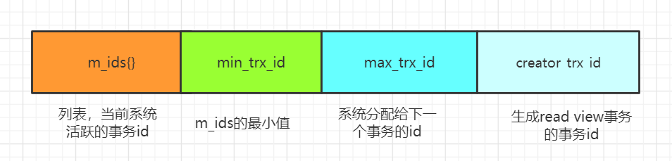

## 什么是数据库的事务

> 版本(5.7)，存储引擎(InnnoDB)，事务隔离级别(RR)。

```mysql
select version();

show variables like '%engine%';

show global variables like 'tx_isolation';
```

### 事务的典型场景

什么地方会使用事务？根据业务类型来使用的还是根据数据操作类型来使用的？无论你是在方法上加@Transactional注解，还是在xml文件里面配 置切面，还是直接用JDBC的方法。

```xml
<tx:advice id="txAdvice" transaction-manager="transactionManager">
<tx:attributes>
<tx:method name="save*" rollback-for="lThrowablel" />
<tx:method name="add*" rollback-for="lThrowablel" />
<tx:method name="send*" rol1back-for="lThrowablel" />
<tx:method name="insert*" rollback-for="lThrowablel" />
</tx:attributes>
</tx:advice>
```

很多时候我们需要事务是因为我们希望涉及数据库的多个操作都成功，比如客户下 单，会操作订单表，资金表，物流表等等，就需要放在一个事务里面执行。

很多同学在学习数据库事务的时候都接触过一个非常典型的案例，就是银行转账。 如果我们把行内转账简化成一个账户余额减少，另一个账户的余额增加的情况，那么这 两个动作一定是同时成功或者同时失败的，否则就会造成银行的会计科目不平衡。

另外一个例子：12306的接续换乘功能，两张票必须同时购买成功，只买到前半程 或者只买到后半程都是没有意义的。

### 事务的定义

维基百科的定义：事务是数据库管理系统(DBMS)执行过程中的一个逻辑单位，由 一个有限的数据库操作序列构成。

这里面有两个关键点，第一个，所谓的逻辑单位，意味着它是数据库最小的工作单 元，是不可以再分的。第二个，它可能包含了一个或者一系列的DML语句，包括insert delete updateo。(单条 DDL (create drop)和 DCL (grant revoke)也会有事务)

### 哪些存储引擎支持事务

并不是所有的数据库或者所有的存储引擎都支持事务，它是作为一种特性出现的。 在MySQL所支持的这些存储引擎里面，有哪些是支持事务的呢？

除了做集群的NDB之外，只有InnoDB支持事务，这个也是它成为默认的存储引擎的一个重要原因。

为什么支持事务能够让InnoDB脱颖而岀，事务到底提供了哪些特性呢?

### 事务的四大特性

- 原子性（Atomicity），也就是我们刚才说的不可再分，因为原子是化学上（参加化学反应）最小的单位。也就意味着我们对数据库的一系列的操作，要么都是成功， 要么都是失败，不可能出现部分成功或者部分失败的情况，以刚才提到的转账的场景为 例，一个账户的余额减少，必然对应着另一个账户余额的增加。全部成功比较简单，问题是如果前面一个操作已经成功了，后面的操作失败了，怎 么让它全部失败呢？这个时候我们必须要回滚。原子性，在InnoDB里面是通过undo log来实现的，它记录了数据修改之前的值（逻 辑日志），一旦发生异常，就可以用undo log来实现回滚操作。

- 隔离性（Isolation），我们有了事务的定义以后，在数据库里面会有很多的。事务同时去操作我们的同一张表或者同一行数据，必然会产生一些并发或者干扰的操作。 我们对隔离性的定义，就是这些很多个的事务，对表或者行的并发操作，应该是透明的， 互相不干扰的。比如两个人给青山转账100，开启两个事务，都拿到了青山账户的余额 1000，然后各自基于1000加100，最后结果是1100，就出现了数据混乱的问题。在InnoDB中隔离性怎么实现呢？这个我们后面再详细分析。

- 持久性（Durability），事务的持久性是什么意思呢？我们对数据库的任意的操作，增删改，只要事务提交成功，那么结果就是永久性的，不可能因为数据库掉电、 宕机、意外重启，又变成原来的状态。这个就是事务的持久性。持久性怎么实现呢？回想一下，InnoDB崩溃恢复(crash-safe)是通过什么实现的?持久是通过redo log和double write buffer (双写缓冲)来实现的，我们操作数据的时候，会先写到内存的buffer pool里面，同时记录red log，如果在刷盘之前出现异常，在重启后就可以读取redo log的内容，写入到磁盘，保证数据的持久性。当然，恢复成功的前提是数据页本身没有被破坏，是完整的，这个通过双写缓冲保证。

- 一致性（Consistent），指的是数据库的完整性约束没有被破坏，事务执行的前后都是合法的数据状态。数据库自身提供了一些约束：比如主键必须是唯一的，字段长度符合要求。另外还有用户自定义的完整性。比如说转账的这个场景，A账户余额减少1000， B账户余额只增加了 500，两个操作都成功了，它是满足原子性的定义的，但是它不满足用户自定义的一致性，因为它导 致了会计科目的不平衡。还有一种情况，A账户余额为0，如果这个时候转账成功了，A账户的余额会变成-1000，虽然它也满足原子性，但是我们知道，借记卡的余额是不能够小于0的，所以也违反了一致性。用户自定义的完整性通常要在代码中控制。

> 需要注意的是，原子性，隔离性，持久性，最后都是为了实现一致性。

### 数据库什么时候会出现事务

当我执行这样一条更新语句的时候，它有事务吗?

```mysql
update student set name ='test' where id=1;
```

 实际上，它不仅自动开启了一个事务，而且自动提交了，所以最终写入了磁盘。这个是开启事务的第一种方式，增删改的语句会自动开启事务，当然是一条SQL 一 个事务。注意每个事务都是有编号的，这个编号是一个整数，有递增的特性。如果要把多条SQL放在一个事务里面，就要手动开启事务。手动开启事务有两种方 式： 一种是用 begin， —种是用 start transaction。那么怎么结束一个事务呢？结束也有两种方式：第一种是回滚事务rollback，事务 结束。第二种就是提交一个事务，commit，事务结束。InnoDB里面有一个autocommit的参数（分为两个级别，session级别和global 级别）。

```mysql
show variables like 'autocommit';
```

它的默认值是ON。autocommit这个参数是什么意思呢？是否自动提交。如果它的 值是true/on的话，我们在操作数据的时候，会自动提交事务。否则的话，如果我们把autocommit设置成false/off，那么数据库的事务就需要我 们手动地结束，用rollback或者commit。还有一种情况，客户端的连接断开的时候，事务也会结束。

### 事务并发会带来哪些问题

- 脏读

  我们有两个事务，一个是事务编号2673， —个是事务编号2674。在第一个事务里 面，它首先通过一个where id = 1的条件査询一条数据，返回name二Ada， age=16的 这条数据。然后第二个事务呢，它同样地是去操作id = 1的这行数据，它通过一个update的语句，把这行id = 1的数据的age改成了 18，但是大家注意，它没有提交。这个时候，在第一个事务里面，它再次去执行相同的查询操作，发现数据发生了变化，获取到的数据age变成了 18。那么，这种在一个事务里面，由于其他的时候修改了 数据并且没有提交，而导致了前后两次读取数据不一致的情况。

  ```
  图片
  ```

- 不可重复读、

  如果在转账的案例里面，我们第一个事务基于读取到的第二个事务未提交的余额进 行了操作，但是第二个事务进行了回滚，这个时候就会导致数据不一致。同样是两个事务，第一个事务通过id=1査询到了一条数据。然后在第二个事务里面 执行了一个up date操作，这里大家注意一下，执行了 up date以后它通过一个commit 提交了修改。然后第一个事务读取到了其他事务已提交的数据导致前后两次读取数据不 一致的情况，就像这里，age到底是等于16还是18，那么这种事务并发带来的问题， 我们把它叫做什么？这种一个事务读取到了其他事务已提交的数据导致前后两次读取数据不一致的情况，我们把它叫做`不可重复读`。、

  ```
  图片
  ```

- 幻读

  在第一个事务里面我们执行了一个范围查询，这个时候满足条件的数据只有一条。在第二个事务里面，它插入了一行数据，并且提交了。重点：插入了一行数据。在第一 个事务里面再去查询的时候，它发现多了一行数据。这种情况就好像突然冒出来的一个 幻影一样，我们把它叫做什么呢？一个事务前后两次读取数据数据不一致，是由于其他事务插入数据造成的，这种情 况我们把它叫做`幻读`。

  ```
  图片
  ```

不可重复读和幻读最大的区别在那里呢？

修改或者删除造成的读不一致叫做不可重复读，插入造成的读不一致叫做幻读。

这里有两个点务必要跟大家说明一下：

1、一个事务读取到其他事务最新提交的数据，这不是正常的吗？当然是正常的，所 以我们这里讨论的是读一致性。读一致性的意义就是一个事务的select操作跟其他事务 没有瓜葛，你不需要修改数据，所以不需要获取最新的数据，这样能够提高并发性能。

2、如果在第一个事务里面，select以后，再执行一个update，就能获取到第二个事务的最新数据，这个怎么解释？同样的，这个也脱离了读一致性的讨论范畴。如果要 修改数据，必然会读取到最新的数据，也会影响其他的事务。所以这里要不要修改，要不要读取到最新的数据，是一个区别点。目前我们讨论的都是在一个事务里面多次重复读取。

>小结：我们刚才讲了事务并发带来的三大问题，现在来给大家总结一下。无论是脏读，还是不可重复读，还是幻读，它们都是数据库的读一致性的问题，都在一个事务 里面前后两次读取出现了不一致的情况。读一致性的问题，必须要由数据库提供一定的事务隔离机制来解决。就像我们去饭店吃饭，基本的设施和卫生保证都是饭店提供的。那么我们使用数据库，隔离性的问题 也必须由数据库帮助我们来解决。

### SQL92标准事务隔离级别定义

美国国家标准协会(ANSI)制定了一个SQL标准，也就是说建议数据库厂商都按照这个标准，提供一定的事务隔离级别，来解决事务并发的问题。这个SQL标准有很多的版本，大家最熟悉的是SQL92标准。

https://arxiv.org/ftp/cs/papers/0701/0701157.pdf

| Isolation Level       | P1 (or A1) Dirty Read | P2 (or A2) Fuzzy Read | P3 (or A3) Phantom |
| --------------------- | --------------------- | --------------------- | ------------------ |
| ANSI READ UNCOMMITTED | Possible              | Possible              | Possible           |
| ANSI READ COMMITTED   | Not Possible          | Possible              | Possible           |
| ANSI REPEATABLE READ  | Not Possible          | Not Possible          | Possible           |
| ANOMALY SERIALIZABLE  | Not Possible          | Not Possible          | Not Possible       |

里面定义了四个隔离级别，右边的P1，P2，P3就是代表事务并发的3个问题，脏读，不可重复读，幻读。Possible代表在这个隔离级别下，这个问题有可能发生，换句话说，没有解决这个问题。Not Possible就是解决了这个问题。我们详细地分析一下这4个隔离级别是怎么定义的。

- Read Uncommitted （未提交读）一个事务可以读取到其 他事务未提交的数据，会出现脏读，所以叫做RU，它没有解决任^的问题。
- Read Committed （已提交读）也就是一个事务只能读取 到其他事务已提交的数据，不能读取到其他事务未提交的数据，它解决了脏读的问题， 但是会出现不可重复读的问题。
- Repeatable Read （可重复读）它解决了不可重复读的问题， 也就是在同一个事务里面多次读取同样的数据结果是一样的，但是在这个级别下，没有 定义解决幻读的问题。
- Serializable （串行化）在这个隔离级别里面，所有的事务都是串 行执行的，也就是对数据的操作需要排队，已经不存在事务的并发操作了，所以它解决 了所有的问题。

事务隔离级别是可以修改的

```mysql
set global transaction isolation level read uncommitted;
set global transaction isolation level read committed;
set global transaction isolation level repeatable read;
set global transaction isolation level serializable;
```

这个是SQL92的标准，但是不同的数据库厂商或者存储引擎的实现有一定的差异，比如Oracle里面就只有两种RC （已提交读）和Serializable （串行化）。那么MySQL 中支持事务的存储引擎InnoDB的实现又是怎么样的呢？

### InnoDB事务隔离级别的实现

| 事务隔离级别                | 脏读   | 不可重复读 | 幻读           |
| --------------------------- | ------ | ---------- | -------------- |
| 未提交读(Read Uncommitted ) | 可能   | 可能       | 可能           |
| 已提交读(Read Committed )   | 可能   | 可能       | 可能           |
| 可重复读(Repeatable Read)   | 不可能 | 不可能     | 对InnoDB不可能 |
| 串行化(Serializable )       | 不可能 | 不可能     | 不可能         |

InnoDB支持的四个隔离级别和SQL92定义的完全一致，隔离级别越高，事务的并 发度就越低。唯一的区别就在于，InnoDB在RR的级别就解决了幻读的问题。也就是说，不需要使用串行化的隔离级别去解决所有问题，既保证了数据的一致性，又支持较高的并发度。这个就是InnoDB默认使用RR作为事务隔离级别的原因。

### 读一致性解决方案

如果要解决读一致性的问题，保证一个事务中前后两次读取数据结果一致，实现事务隔离，总体上来说，我们有两大类的方案。

### LBCC

既然要保证前后两次读取数据一致，那么我读取数据的时候，锁定我要操 作的数据，不允许其他的事务修改就行了。这种方案我们叫做基于锁的并发控制Lock Based Concurrency Control (LBCC)。

如果仅仅是基于锁来实现事务隔离，一个事务读取的时候不允许其他时候修改，那 就意味着不支持并发的读写操作，而我们的大多数应用都是读多写少的，这样会极大地 影响操作数据的效率。

### MVCC

所以我们还有另一种解决方案，如果要让一个事务前后两次读取的数据保持一致， 那么我们可以在修改数据的之前给它建立一个备份或者叫快照，后面再来读取这个快照 就行了。这种方案我们叫做多版本的并发控制Multi Version Concurrency Control （MVCC）。 

MVCC的原则：

- 一个事务能看到的数据版本
  -   第一次查询之前已经提交的事务的修改
  - 本事务的修改
- 一个事务不能看见的数据版本：
  - 在本事务第一次查询之后创建的事务（事务ID比我的事务ID大）
  - 活跃的（未提交的）事务的修改

MVCC的效果：我可以査到在我这个事务开始之前已经存在的数据，即使它在后面被修改或者删除了。而在我这个事务之后新增的数据，我是查不到的。所以我们才把这个叫做快照，不管别的事务做任何增删改查的操作，它只能看到第 一次查询时看到的数据版本。

下面我们来分析一下MVCC的原理。首先，InnoDB的事务都是有编号的，而且会 不断递增。InnoDB为每行记录都实现了两个隐藏字段：

`DB_TRX_ID`， 6字节：事务ID数据是在哪个事务插入或者修改为新数据的，就记录为当前事务ID。

`DB_ROLL_PTR`， 7字节：回滚指针（我们把它理解为删除版本号，数据被删除或记录为旧数据的时候，记录当前事务ID，没有修改或者删除的时候是空）

| id   | name | `DB_TRX_ID` | DB_ROLL_PTR |
| ---- | ---- | :---------: | ----------- |
| 1    | aa   |     01      | NULL        |

第一个事务，初始化数据（检查初始数据）

```mysql
# Transaction1
begin;
insert into mvcctest valuestNULL， 'test1'）;
insert into mvcctest values（NULL， 'test2'）;
commit;
```

此时的数据，创建版本是当前事务ID （假设事务编号是1），删除版本为空：

| id   | name  | 创建版本 | 删除版本  |
| ---- | ----- | -------- | --------- |
| 1    | test1 | 1        | undefined |
| 2    | test2 | 1        | undefined |

第二个事务，执行第1次查询，读取到两条原始数据，这个时候事务ID是2：

```mysql
# Transaction2
begin;
select * from mvcctest; #(1)第一次查询
```

第三个事务，插入数据：

```mysql
# Iransaction3
begin;
insert into mvcctest values(NULL，'test3');
commit;
```

此时的数据，多了一条`test3`，它的创建版本号是当前事务编号3：

|      | name  | 创建版本 | 删除版    |
| ---- | ----- | -------- | --------- |
| 1    | test1 | 1        | undefined |
| 2    | test2 | 1        | undefined |
| 3    | test3 | `3`      | undefined |

第二个事务，执行第2次查询：

```mysql
# Transaction2
begin;
select * from mvcctest; # (2)第二次查询
```

MVCC的査找规则：只能査找创建时间小于等于当前事务ID的数据，和删除时间大于当前事务ID的行（或未删除）。也就是不能查到在我的事务开始之后插入的数据，tom的创建ID大于2，所以还是只能査到两条数据。

第四个事务，删除数据，删除了 id=2，`test2`这条记录：

```mysql
# Transaction4
begin;
delete from mvcctest where id=2;
commit;
```

此时的数据，`test2`的删除版本被记录为当前事务ID4，其他数据不变：

| id   | name  | 创建版本 | 删除版本  |
| ---- | ----- | -------- | --------- |
| 1    | test1 | 1        | undefined |
| 2    | test2 | 1        | `4`       |
| 3    | test3 | 3        | undefined |

在第二个事务中，执行第3次査询：

```mysql
# Transaction2
begin;
select * from mvcctest; # (3)第三次查询
```

查找规则：只能查找创建时间小于等于当前事务ID的数据，和删除时间大于当前事 务ID的行（或未删除）。也就是，在我事务开始之后删除的数据，所以`test2`依然可以查出来。所以还是这 两条数据。

第五个事务，执行更新操作，这个事务事务ID是5：

```mysql
# iransaction4
begin;
update mvcctest set name ='盆鱼宴' where id=1;
commit;
```

此时的数据，更新数据的时候，旧数据的删除版本被记录为当前事务ID 5 (undo)，产生了一条新数据，创建ID为当前事务ID5:

| id   | name   | 创建版本 | 删除版本  |
| ---- | ------ | -------- | --------- |
| 1    | test1  | 1        | `5`       |
| 2    | test2  | 1        | 4         |
| 3    | test3  | 3        | undefined |
| 1    | 盆鱼宴 | `5`      | undefined |

第二个事务，执行第4次查询：

```mysql
# Transaction2
begin;
select * from mvcctest; # (4)第四次查询
```

查找规则：只能查找创建时间小于等于当前事务ID的数据，和删除时间大于当前事 务ID的行(或未删除)。因为更新后的数据penyuyan创建版本大于2，代表是在事务之后增加的，查不出来。而旧数据qingshan的删除版本大于2，代表是在事务之后删除的，可以查出来。

通过以上演示我们能看到，通过版本号的控制，无论其他事务是插入、修改、删除， 第一个事务查询到的数据都没有变化。这个是MVCC的效果。当然，这里是一个简化的模型。

假设一条数据修改了3次，两次提交了一次未提交。每次修改之后都有开启一个事务去查询，那么事务2、4、6査到的数据会有不一样。

| trx id | SQL                                                      |
| ------ | -------------------------------------------------------- |
| trxl   | update userjnfo set name='penyuyan' where id=l; commit;  |
| trx2   | select name from userjnfo where id=l;                    |
| trx3   | update userjnfo set name='wuyanzu' where id=l; commit;   |
| trx4   | select name from userjnfo where id=l;                    |
| trx5   | update userjnfo set name=，liudehua， where id=l; 未提交 |
| trx6   | select name from userjnfo where id=l;                    |
|        | trx2、4、6再各查一次                                     |

InnoDB中，一条数据的旧版本，是存放在哪里的呢？ undo logo因为修改了多次， 这些undo log会开，成一个链条，叫做undo log链，现在undo log里面有deihua、yanzu、yuyan。

所以前面我们说的`DB_ROLL_PTR`，它其实就是指向`undo log`链的指针。

所以，我们必须要有一个数据结构，把本事务心、活跃事务ID、当前系统最大事务ID存起来，这样才能实现判断。这个数据结构就叫`Read View`（可见性视图），每个事务都维护一个自己的`Read View`。



- m_ids 表示在生成ReadView时当前系统中活跃的读写事务的事务id列表。
-  min_trx_id 表示在生成ReadView时当前系统中活跃的读写事务中最小的事务id，也就是m ids中的最小值。

- max_trx_id 表示生成ReadView时系统中应该分配给下一个事务的id值。

- creator_trx_id 表示生成该ReadView的事务的事务id。

有了这个数据结构以后，事务判断可见性的规则是这样的：

- 从数据的最早版本开始判断（undo log）。
- 数据版本的trx_id = creator trx id，本事务修改’可以访问。
- 数据版本的trx_id < min_trx_id （未提交事务的最小ID），说明这个版本在 生成ReadView已经提交，可以访问。
- 数据版本的trx id > max_trx_id （下一个事务ID），这个版本是生成ReadView 之后才开启的事务建立的，不能访问。
- 数据版本的trx id在min trx id和max_trx_id之间，看看是否在m ids中。 如果在，不可以。如果不在，可以。
- 如果当前版本不可见，就找undo log链中的下一个版本。

>注意：
>
>RR中Read View是事务第一次査询的时候建立的。RC的Read View是事务每次查询的时候建立的。
>
>Oracle. Postgres等等其他数据库都有MVCC的实现。需要注意，在InnoDB中，MVCC和锁是协同使用的，这两种方案并不是互斥的。

## InnoDB锁的基本类型

### 锁的粒度

Mysql 存储引擎中，InnoDB 和 MyISAM支持的锁的类型是不同的，MylSAM只支持表锁，用lock table的语法加锁。

```mysql
lock tables xxx read;
lock tables xxx write;
unlock tables ;
```

而InnoDB同时支持表锁和行锁。

| 锁定粒度    | 加锁效率    | 冲突概率    | 并发性能    |
| ----------- | ----------- | ----------- | ----------- |
| 表锁 > 行锁 | 表锁 > 行锁 | 表锁 > 行锁 | 表锁 < 行锁 |

### 锁的类型

This section describes lock types used by `InnoDB`.

- [Shared and Exclusive Locks](https://dev.mysql.com/doc/refman/8.0/en/innodb-locking.html#innodb-shared-exclusive-locks)
- [Intention Locks](https://dev.mysql.com/doc/refman/8.0/en/innodb-locking.html#innodb-intention-locks)
- [Record Locks](https://dev.mysql.com/doc/refman/8.0/en/innodb-locking.html#innodb-record-locks)
- [Gap Locks](https://dev.mysql.com/doc/refman/8.0/en/innodb-locking.html#innodb-gap-locks)
- [Next-Key Locks](https://dev.mysql.com/doc/refman/8.0/en/innodb-locking.html#innodb-next-key-locks)
- [Insert Intention Locks](https://dev.mysql.com/doc/refman/8.0/en/innodb-locking.html#innodb-insert-intention-locks)
- [AUTO-INC Locks](https://dev.mysql.com/doc/refman/8.0/en/innodb-locking.html#innodb-auto-inc-locks)
- [Predicate Locks for Spatial Indexes](https://dev.mysql.com/doc/refman/8.0/en/innodb-locking.html#innodb-predicate-locks)

我们可以看到，官网把锁分成了 8类。我们把前面的两个行级别的锁(`Shared and Exclusive Locks`)，和两个表级别的锁(`Intention Locks`)称为锁的基本模式。后面三个`Record Locks`、` Gap Locks`、 `Next-Key Locks`，我们把它们叫做锁的算法， 也就是分别在什么情况下锁定什么范围。

- 插入意向锁：是一个特殊的间隙锁。间隙锁不允许插入数据，但是插入意向锁允许 多个事务同时插入数据到同一个范围。比如(4，7)， —个事务插入5， —个事务插入6，不 会发生锁等待。

- 自增锁：是一种特殊的表锁，用来防止自增字段重复，数据插入以后就会释放，不 需要等到事务提交才释放。如果需要选择更快的自增值生成速度或者更加连续的自增值， 就要通过修改自增锁的模式改变。

```mysql
show variables like 'Innodb_autoinc_lock_mode';
```

- 0: traditonal (每次都会产生表锁)。

- 1: consecutive (会产生一个轻量锁，simple insert会获得批量的锁，保证连续插入，默认值)。

- 2: interleaved （不会锁表，来一个处理一个，并发最高）。

Predicate Locks for Spatial Indexes是5.7版本里面新增的一种数据类型的索引的锁。

### 共享锁

第一个行级别的锁就是我们在官网看到的`Shared Locks`（共享锁），我们获取了一 行数据的读锁以后，可以用来读取数据，所以它也叫做读锁，注意不要在加上了读锁以 后去写数据，不然的话可能会出现死锁的情况。而且多个事务可以共享一把读锁。

共享锁的作用：因为共享锁会阻塞其他事务的修改，所以可以用在不允许其他事务修改数据的情况（共享锁和写锁互斥的例子后面再看）。

那怎么给一行数据加上读锁呢？

我们可以用**select 	..... lock in share mode;**的方式手工加上一把读锁。

释放锁有两种方式，只要事务结束，锁就会自动事务，包括提交事务和结束事务。

验证一下，看看共享锁是不是可以重复获取。

| Transaction1                                          | Transaction 2                                             |
| ----------------------------------------------------- | --------------------------------------------------------- |
| begin;                                                |                                                           |
| SELECT * FROM student WHERE id= 1 LOCK IN SHARE MODE; |                                                           |
|                                                       | begin;                                                    |
|                                                       | SELECT * FROM student WHERE id=1 LOCK IN SHARE MODE;  #OK |

### 排他锁

第二个行级别的锁叫做`Exclusive Locks`（排它锁），它是用来操作数据的，所以又 叫做写锁。只要一个事务获取了一行数据的排它锁，其他的事务就不能再获取这一行数 据的共享锁和排它锁。排它锁的加锁方式有两种，第一种是自动加排他锁，可能是同学们没有注意到的： 我们在操作数据的时候，包括增删改，都会默认加上一个排它锁。还有一种是手工加锁，我们用一个FOR UPDATE给一行数据加上一个排它锁，这个 无论是在我们的代码里面还是操作数据的工具里面，都比较常用。释放锁的方式跟前面是一样的。

排他锁的验证：

| Transaction1                                       | Transaction 2                                                |
| -------------------------------------------------- | ------------------------------------------------------------ |
| begin;                                             |                                                              |
| UPDATE student SET sname ='李大彪 555' WHERE id=1; |                                                              |
|                                                    | begin;                                                       |
|                                                    | SELECT * FROM student WHERE id=1 LOCK IN SHARE MODE;  # BLOCKED<br />SELECT * FROM student where id=1 FOR UPDATE;   # BLOCKED <br />DELETE FROM student where id=1;  # BLOCKED |

这个是两个行锁，接下来就是两个表锁。

### 意向锁

意向锁是什么呢？我们好像从来没有听过，也从来没有使用过，其实他们是由数据 库自己维护的。也就是说，当我们给一行数据加上共享锁之前，数据库会自动在这张表上面加一个 意向共享锁。当我们给一行数据加上排他锁之前，数据库会自动在这张表上面加_个意向排他锁。反过来：如果一张表上面至少有一个意向共享锁**，**说明有其他的事务给其中的某些数据行加上了共享锁。如果一张表上面至少有一个意向排他锁，说明有其他的事务给其中的某些数据行加 上了排他锁。

```mysql
select * firom t2 where id =4 for update;
```

>TABLE LOCK table 'gupao'.'t2' trx id 24467 lock mode IX
>
>RECORD LOCKS space id 64 page no 3 n bits 72 index PRIMARY of table、gupao'・、t2' trx id 24467 lock_mode X locks rec but not gap

意向锁跟意向锁是不冲突的，意向锁跟行锁也不冲突。那么这两个表级别的锁存在的意义是什么呢？

如果说没有意向锁的话，当我们准备给一张表加上表锁的时候，我们首先要做什么？ 是不是必须先要去判断有没其他的事务锁定了其中了某些行？如果有的话，肯定不能加 上表锁。那么这个时候我们就要去扫描整张表才能确定能不能成功加上一个表锁，如果 数据量特别大，比如有上千万的数据的时候，加表锁的效率是不是很低？但是我们引入了意向锁之后就不一样了。我只要判断这张表上面有没有意向锁，如 果有，就直接返回失败。如果没有，就可以加锁成功。所以InnoDB里面的表锁，我们 可以把它理解成一个标志。就像火车上卫生间有没有人使用的灯，让你不用去推门，是 用来提高加锁的效率的。

| Transaction1                                 | Transaction 2                                                |
| -------------------------------------------- | ------------------------------------------------------------ |
| begin;                                       |                                                              |
| SELECT * FROM student where id=l FOR UPDATE; |                                                              |
|                                              | BEGIN;                                                       |
|                                              | LOCK TABLES student WRITE; # BLOCKED UNLOCK TABLES; # 释放表锁的方式 |

锁的作用：它跟Java里面的锁是一样的，是为了解决资源竞争的问题，Java 里面的资源是对象，数据库的资源就是数据表或者数据行。所以锁是用来解决事务对数据的并发访问的问题的。

锁到底锁住了什么呢？当一个事务锁住了一行数据的时候，其他的事务不能操作这一行数据，那它到底是锁住了这一行数据，还是锁住了这一个字段，还是锁住了别的什么东西呢？


## 锁的原理

### 没有索引的表（假设锁住记录）

首先我们有三张表，一张没有索引的t1，一张有主键索引的t2，一张有唯一索引的 t3。

我们先假设InnoDB的行锁锁住了是一行数据或者一条记录。

我们先来看一下t1的表结构，它有两个字段，int类型的id和varchar类型的name。

里面有4条数据，1、2、3、4。

| Transaction1                             | Transaction 2                                              |
| ---------------------------------------- | ---------------------------------------------------------- |
| begin;                                   |                                                            |
| SELECT * FROM tl WHERE id =1 FOR UPDATE; |                                                            |
|                                          | select * from tl where id=3 for update; # blocked          |
|                                          | INSERT INTO 'tl' ('id'， 'name') VALUES (5， S); # blocked |

我们在两个会话里面手工开启两个事务。

在第一个事务里面，我们通过where id =1锁住第一行数据。

在第二个事务里面，我们尝试给id = 3的这一行数据加锁，能成功吗？

很遗憾，我们看到红灯亮起，这个加锁的操作被阻塞了。这就有点奇怪了，第一个事务锁住了 id = 1的这行数据，为什么我不能操作id=3的数据呢？

我们再来操作一条不存在的数据，插入id=5。它也被阻塞了。实际上这里整张表都 被锁住了。所以，我们的第一个猜想被推翻了，**InnoDB的行锁锁住的应该不是Record**。

### 有主键索引的表

我们看一下t2的表结构。字段是一样的，不同的地方是id上创建了一个主键索引。里面的数据是1、4、7、10。

| Transaction1                            | Transaction 2                                      |
| --------------------------------------- | -------------------------------------------------- |
| begin;                                  |                                                    |
| select * from t2 where id=l for update; |                                                    |
|                                         | select * from t2 where id=l for update; // blocked |
|                                         | select * from t2 where id=4 for update; // OK      |

第一种情况，使用相同的id值去加锁，冲突；使用不同的id加锁，可以加锁成功。 那么，既然不是锁定_行数据，有没有可能是锁住了 id的这个字段呢？

### 唯一索引（假设锁住字段）

我们看一下t3的表结构。字段还是一样的，id上创建了一个主键索引，name上 创建了一个唯一索引。里面的数据是1、4、7、10。

| Transaction1                                 | Transaction 2                                            |
| -------------------------------------------- | -------------------------------------------------------- |
| begin;                                       |                                                          |
| select * from t3 where name= '4' for update; |                                                          |
|                                              | select * from t3 where name = '4' for update; // blocked |
|                                              | select * from t3 where id = 4 for update; // blocked     |

在第一个事务里面，我们通过name字段去锁定值是4的这行数据。

在第二个事务里面，尝试获取一样的排它锁，肯定是失败的，这个不用怀疑。

在这里我们怀疑InnoDB的行锁锁住的是字段，所以这次我换一个字段，用id=4去 给这行数据加锁，能成功吗？

很遗憾，又被阻塞了，说明行锁锁住的是字段的这个推测也是错的，否则就不会出 现第一个事务锁住了 name，第二个字段锁住id失败的情况。

既然锁住的不是record，也不是column， InnoDB的行锁锁住的到底是什么呢？在 这三个案例里面，我们要去分析一下他们的差异在哪里，也就是这三张表的结构，是什 么区别导致了加锁的行为的差异？其实答案就是索引。InnoDB的行锁，就是通过锁住索 引来实现的。


## 锁的算法


## 事务隔离级别怎么选

RU和Serializable肯定不能用。为什么有些公司要用RC，或者说网上有些文章推荐RC。

RC和RR主要有几个区别：

- RR的间隙锁会导致锁定范围的扩大。
- 条件列未使用到索弓I， RR锁表，RC锁行。
- RC的"半一致性"（semi-consistent）读可以增加update操作的并发性。
- 在RC中，一update语句，如果读到一行已经加锁的记录，此时InnoDB返回记 录最近提交的版本，由MySQL上层判断此版本是否满足update的where条件。若满足(需要更新)，则MySQL会重新发起一次读操作，此时会读取行的最新版本(并加锁)。

使用RC的好处：

>Using read committed as additional effects:
>
>o For `update` or `delete` statements， InnoDB holds locks only for rows that it updates or deletes. Record locks for nonmatching rows are released after MySQL has evaluated the where condition. This greatly reduces the probability of deadlocks， but they can still happen.
>
>o For `update` statements， if a row is already locked， InnoDB performs a "scmi-consistent" read， returning the latest committed version to MySQL so that MySQL can determine whether the row matches the where condition of the update. If the row matches (must be updated)， MySQL reads the row again and this time InnoDB either locks it or waits for a lock on it.

实际上，如果能够正确地使用锁(避免不使用索引去枷锁)，只锁定需要的数据，用默认的RR级别就可以了。在我们使用锁的时候，有一个问题是需要注意和避免的，我们知道，排它锁有互斥 的特性。一个事务或者说一个线程持有锁的时候，会阻止其他的线程获取锁，这个时候 会造成阻塞等待，如果循环等待，会有可能造成死锁。这个问题我们需要从几个方面来分析，一个是锁为什么不释放，第二个是被阻塞了 怎么办，第三个死锁是怎么发生的，怎么避免。


## 死锁

### 锁什么时候释放

事务结束(commit， rollback)，客户端连接断开。

如果一个事务一直未释放锁，其他事务会被阻塞多久？会不会永远等待下去？如果是，在并发访问比较高的情况下，如果大量事务因无法立即获得所需的锁而挂起，会占用大量计算机资源，造成严重性能问题，甚至拖跨数据库。

>[Err] 1205 - Lock wait timeout exceeded; try restarting transaction 

MySQL有一个参数来控制获取锁的等待时间，默认是50秒。

```mysql
show VARIABLES like 'Innodb_lock_wait_timeout';
```

### 死锁的发生和检测

死锁演示: 案例1

| 0Session                                             | Session 2                                |
| ---------------------------------------------------- | ---------------------------------------- |
| begin;<br />select * from t2 where id =1 for update; |                                          |
|                                                      | begin;<br />delete from t2 where id =4 ; |
| update t2 set name= '4d' where id =4 ;               |                                          |
|                                                      | delete from t2 where id =1;              |

案例2

| Session                                                | Session 2                                              |
| ------------------------------------------------------ | ------------------------------------------------------ |
| begin;select * from tl where id =1 lock in share mode; |                                                        |
|                                                        | begin;select * from tl where id =1 lock in share mode; |
| update tl set name= 'la' where id =1;                  |                                                        |
|                                                        | update tl set name= 'la' where id =1;                  |

我们看到：在第一个事务中，检测到了死锁，马上退岀了，第二个事务获得了锁，不需要等待50秒：

>[Err] 1213 ・ Deadlock found when trying to get lock; try restarting transaction

为什么可以直接检测到呢？是因为死锁的发生需要满足一定的条件，所以在发生死锁时，InnoDB —般都能通过算法(wait-for graph)自动检测到。

那么死锁需要满足什么条件？死锁的产生条件，因为锁本身是互斥的：

-  同一时刻只能有一个事务持有这把锁；
- 其他的事务需要在这个事务释放锁之后才能获取锁，而不可以强行剥夺；
- 当多个事务形成等待环路的时候，即发生死锁

### 查看锁信息（日志）

首先，SHOW STATUS命令中，包括了一些行锁的信息：

```mysql
show status like 'innodb_row_lock_%';
```


| Variable_name                 | Value |
| ----------------------------- | ----- |
| Innodb_row_lock_waits         | 0     |
| Innodb_row_lock_time_max      | 0     |
| Innodb_row_lock_time_avg      | 0     |
| Innodb_row_lock_time          | 0     |
| Innodb_row_lock_current_waits | 0     |

- lnnodb_row_lock_current_waits：当前正在等待锁定的数量；
- lnnodb_row_lock_time :从系统启动到现在锁定的总时间长度，单位ms； 
- lnnodb_row_lock_time_avg :每次等待所花平均时间；
- lnnodb_row_lock_time_max：从系统启动到现在等待最长的一次所花的时间；
-  lnnodb_row_lock_waits :从系统启动到现在总共等待的次数。

**SHOW**命令是一个概要信息。InnoDB还提供了三张表来分析事务与锁的情况:

```mysql
select * from information_schema.INNODB_TRX; # 当前运行的所有事务，还有具体的语句
```

```mysql
select * from information_schema.INNODB_LOCKS; # 当前出现的锁
```

```mysql
select * from information_schema.INNODB_LOCK_WAITS; # 锁等待的对应的关系
```

更加详细的锁信息，开启标准监控和锁监控:

```mysql
set GLOBAL innodb_status_output=ON; 
set GLOBAL innodb_status_output_locks=ON;
```

如果一个事务长时间持有锁不释放，可以kill事务对应的线程ID，也就是INNODB_TRX表中的trx_mysql_thread_id，例如执行kill 4，kill 7， kill 8。当然，死锁的问题不能每次都靠kill线程来解决，这是治标不治本的行为，我们应该尽量在应用端，也就是在编码的过程中避免。

### 死锁的避免

- 在程序中，操作多表时，尽量以相同的顺序来访问（避免形成等待环路）。
- 批量操作单张表数据的时候，先对数据进行排序（避免形成等待环路）。
- 申请足够级别的锁，如果要操作数据，就申请排他锁。
- 尽量使用索引访问数据，避免没有where条件的操作，避免锁表。
- 如果可以，大事务化为小事务。
- 使用等值查询而不是范围查询查询数据，命中记录，避免间隙所对并发的影响。


## Q & A

### Q1：这个快照是怎么实现的呢？会不会占用额外的存储空间？


### Q2：事务2、4、6最后再查一次，它们去undo log链找数据的时候，拿到的数据是不一样的。在这个undo log链里面，一个事务怎么判断哪个版本的数据是它应该读取的呢？


### Q3：为什么支持行锁会成为InnoDB的优势？表锁和行锁的区别到底在哪？


### Q4：为什么在没有索引或者没有用到索引的情况下，会锁住整张表？

- 如果我们定义了主键（PRIMARY KEY），那么InnoDB会选择主键作为聚集索引。
- 如果没有显式定义主键，则InnoDB会选择第一个不包含有NULL值的唯一索 引作为主键索引。
- 如果也没有这样的唯一索引，则InnoDB会选择内置6字节长的ROWID作为隐藏的聚集索引，它会随着行记录的写入而主键递增。

所以，为什么锁表，是因为查询没有使用索引，会进行全表扫描，然后把每一个隐藏的聚集索弓I都锁住了。

### Q4：为什么通过唯一索引给数据行加锁，主键索引也会被锁住？

在辅助索引里面，索引存储的是二级索引和主键的值。比如name=4，存储的是name的索引和主键id的值4。而主键索引里面除了索引之外，还存储了完整的数据。所以我们通过辅助索引锁定 一行数据的时候，它跟我们检索数据的步骤是一样的，会通过主键值找到主键索引，然后也锁定。本质上是因为锁定的是同一行数据，是相互冲突的。


## 待完善。。。