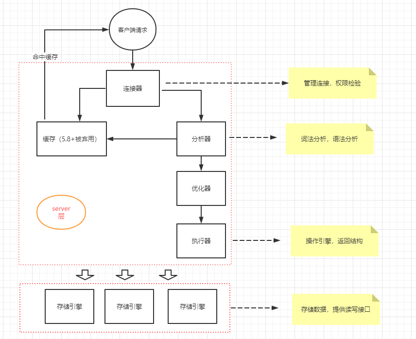
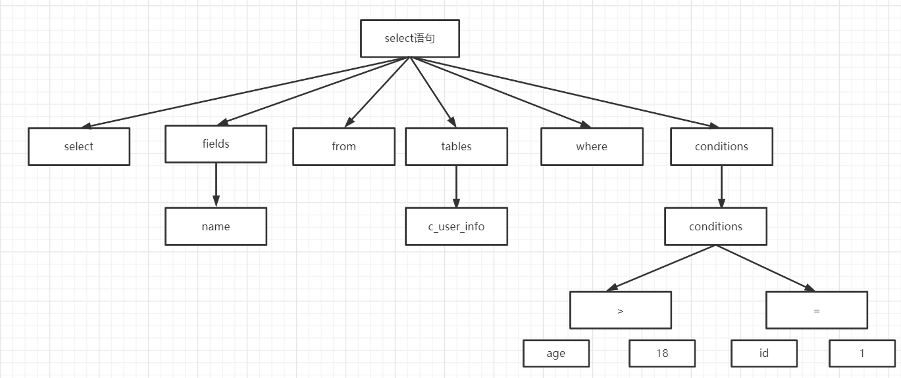
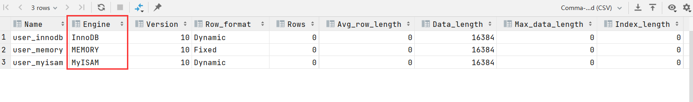
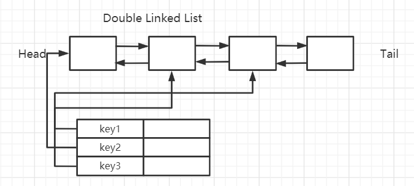
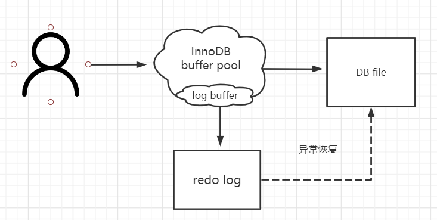

<!--more-->

## 一条查询SQL语句是如何执行的



## 连接


`MySQL`服务监听的端口默认是3306,客户端连接服务端的方式有很多。

可以是同步的也可以是异步的，可以是长连接也可以是短连接，可以是TCP，也可以是Unix Socket, `MySQL`有专门处理连接的模块，连接的时候需要验证权限。

我们怎么查看`MySQL`当前有多少个连接？

可以用show status命令，模糊匹配Thread:

```mysql
show global status like 'Thread%';
```

| 字段              | 含义                                  |
| ----------------- | ------------------------------------- |
| Threads cached    | 缓存中的线程连接数。.                 |
| Threads connected | 当前打开的连接数。                    |
| Threads created   | 为处理连接创建的线程数。              |
| Threads running   | 非睡眠状态的连接数，通常指并发连接数: |

## 查询缓存

MySQL内部自带了一个缓存模块。

有一张500万行数据的表，没有索引，如果我两次执行一模一样的`SQL`语句，第二 次会不会变得很快？

```mysql
select * from user innodb where name='test test'；
```

默认关闭的意思就是不推荐使用，为什么`MySQL`不推荐使用它自带的缓存呢？ 主要是因为`MySQL`自带的缓存的应用场景有限，第一个是它要求`SQL`语句必须一 模一样，中间多一个空格，字母大小写不同都被认为是不同的的`SQL`。

第二个是表里面任何一条数据发生变化的时候，这张表所有缓存都会失效，所以对 于有大量数据更新的应用，也不适合。

所以缓存这一块，我们还是交给`0RM`框架(比如`MyBatis`默认开启了一级缓存)， 或者独立的缓存服务，比如`Redis`来处理更合适。

> `MySQL` 8.0中，查询缓存已经被移除了。


## 语法解析和预处理(Parser & Preprocessor)

没有使用缓存的话，就会跳过缓存的模块，下一步要做什么呢？

为什么一条SQL语句能够被识别呢？假如随便执行一个字符串penyuyan,服务器

报了一个1064的错:

```mysql
[Err] 1064 - You have an error in your SQL syntax; check the manual that corresponds to your MySQL server version for the right syntax to use near 'penyuyan' at line 1
```

它是怎么知道我输入的内容是错误的？

这个就是`MySQ`L的Parser解析器和Preprocessor预处理模块。

这_步主要做的事情是对语句基于`SQL`语法进行词法和语法分析和语义的解析。

### 词法解析


词法分析就是把一个完整的`SQL`语句打碎成一个个的单词。

比如一个简单的`SQL`语句：

```\mysql 
select name from user where id = 1;
```

它会打碎成8个符号，每个符号是什么类型，从哪里开始到哪里结束。


### 语法解析

第二步就是语法分析，语法分析会对`SQL`做一些语法检查，比如单引号有没有闭合, 然后根据`MySQL`定义的语法规则，根据`SQL`语句生成一个数据结构。这个数据结构我 们把它叫做解析树(select lex)。



词法语法分析是一个非常基础的功能，Java的编译器、百度搜索引擎如果要识别语 句，必须也要有词法语法分析功能。

任何数据库的中间件，要解析`SQL`完成路由功能，也必须要有词法和语法分析功能, 比如`Mycat,` `Sharding-JDBC `（用到了 `Druid Parser`）。在市面上也有很多的开源的词 法解析的工具（比如LEX, Yacc） 


### 预处理器

问题：如果我写了一个词法和语法都正确的`SQL`,但是表名或者字段不存在，会在 哪里报错？是在数据库的执行层还是解析器？比如：

```mysql
select * from penyuyan;
```

我想了想，似乎解析器可以分析语法，但是它怎么知道数据库里面有什么表，表里 面有什么字段呢？

实际上还是在解析的时候报错，解析`SQL`的环节里面有个预处理器。它会检査生成的解析树，解决解析器无法解析的语义。比如，它会检査表和列名是否存在，检査名字和别名，保证没有歧义。预处理之后得到一个新的解析树。


## 查询优化(Query Optimizer)与查询执行计划

### 什么是优化器？

得到解析树之后，是不是执行SQL语句了呢？

这里我们有一个问题，一条SQL语句是不是只有一种执行方式？或者说数据库最终 执行的SQL是不是就是我们发送的SQL?

这个答案是否定的。一条SQL语句是可以有很多种执行方式的，最终返回相同的结果，他们是等价的。但是如果有这么多种执行方式，这些执行方式怎么得到的？最终选 择哪一种去执行？根据什么判断标准去选择？

这个就是MySQL的査询优化器的模块(Optimizer)。

査询优化器的目的就是根据解析树生成不同的执行计划(Execution Plan),然后选 择一种最优的执行计划，MySQL里面使用的是基于开销(cost)的优化器，那种执行计 划开销最小，就用哪种。

```mysql
show status like 'Last_query_cost';
```

### 优化器可以做什么？

MySQL的优化器能处理哪些优化类型呢?

举两个简单的例子:

- 当我们对多张表进行关联查询的时候，以哪个表的数据作为基准表。

- 有多个索弓|可以使用的时候，选择哪个索引。

实际上，对于每一种数据库来说，优化器的模块都是必不可少的，他们通过复杂的算法实现尽可能优化查询效率的目标。如果对于优化器的细节感兴趣，可以看看《数据库査询优化器的艺术-原理解析与SQL性能优化》

但是优化器也不是万能的，并不是再垃圾的SQL语句都能自动优化，也不是每次都能选择到最优的执行计划，大家在编写SQL语句的时候还是要注意。

优化完之后，得到一个什么东西呢？优化器最终会把解析树变成一个査询执行计划,查询执行计划是一个数据结构。

我们怎么査看MySQL的执行计划呢？比如多张表关联查询，先査询哪张表？在执行査询的时候可能用到哪些索引，实际上用到了什么索引?

MySQL提供了一个执行计划的工具。我们在SQL语句前面加上EXPLAIN,就可以看到执行计划的信息。

```mysql
EXPLAIN select name fiom user where id=l;
```

如果要得到详细的信息，还可以用`FORMAT=JSON`,或者开启`optimizer trace`

```mysql
EXPLAIN FORMAT=JSON select name from user where id=l;
```

## 存储引擎

得到执行计划以后，SQL语句是不是终于可以执行了?

问题又来了:

- 从逻辑的角度来说，我们的数据是放在哪里的，或者说放在一个什么结构里面?

- 执行计划在哪里执行？是谁去执行?

###  存储引擎基本介绍

比如这三张表，都是二维的存储结构，表面上看起来是一模一样的。




```mysql
show variables like 'datadir';
```

默认情况下，每个数据库有一个自己文件夹，以`ds0`。数据库为例。任何一个存储引擎都有一个`frm`文件，这个是表结构定义文件。


不同的存储引擎存放数据的方式不一样，产生的文件也不一样，innodb是1个, memory没有，myisam 是两个。

这里我们有几个问题：

- 表类型是怎么选择的？可以修改吗？

- MySQL为什么支持这么多存储引擎呢？一种还不够用吗？

- 这些不同的存储引擎，到底有什么区别？

  >.sdi结尾的文件表示

### 存储引擎选择

一张表的存储引擎，是在创建表的时候指定的，使用ENGINE关键字。

```mysql
CREATE TABLE 'user_innodb'
(
    c_id     int(11) NOT NULL AUTO_INCREMENT,
    c_name   varchar(255) DEFAULT NULL,
    c_gender tinyint(1)   DEFAULT NULL,
    c_phone  varchar(11)  DEFAULT NULL,
    PRIMARY KEY (c_id),
    KEY 'comidx_name_phone' (c_name, c_phone)
) ENGINE = InnoDB
  AUTO_INCREMENT = 1
  DEFAULT CHARSET = utf8mb4;
```

没有指定的时候，数据库就会使用默认的存储引擎，5.5.5之前，默认的存储引擎是

MylSAM, 5.5.5之后，默认的存储引擎是InnoDB。

- 试想一下: 如果我有一张表，需要很高的访问速度，而不需要考虑持久化的问题，是不是要把数据放在内存?

- 如果一张表，是用来做历史数据存档的，不需要修改，也不需要索引，那它是不是要支持数据的压缩?

- 如果一张表用在读写并发很多的业务中，是不是要支持读写不干扰，而且要保证比较高的数据一致性呢?

说到这里大家应该明白了，为什么要支持这么多的存储引擎，就是因为我们有不同的业务需求，一种存储引擎不能提供所有的特性。

### 存储引擎比较

常见存储引擎 https://dev.mysql.com/doc/refman/8.0/en/storage-engines.html

#### MylSAM （3个文件）

>These tables have a small footprint. Table-level locking limits the performance in read/write workloads, so it is often used in read-only or read-mostly workloads in Web and data warehousing configurations.

应用范围比较小。表级锁定限制了读/写的性能，因此在Web和数据仓库配置中，

它通常用于只读或以读为主的工作。

特点: 支持表级别的锁（插入和更新会锁表）。不支持事务。

拥有较高的插入（insert）和查询（select）速度。

存储了表的行数（count速度更快）。

（怎么快速向数据库插入100万条数据？我们有一种先用MylSAM插入数据,然后

修改存储引擎为InnoDB的操作。）

适合：只读之类的数据分析的项目。

#### InnoDB （2个文件）

> The default storage engine in MySQL 5.7. InnoDB is a transaction-safe （ACID compliant） storage engine for MySQL that has commit, rollback, and crash-recovery capabilities to protect user data. InnoDB row-level locking （without escalation to coarser granularity locks） and Oracle-style consistent nonlocking reads increase multi-user concurrency and performance. InnoDB stores user data in clustered indexes to reduce I/O for common queries based on primary keys. To maintain data integrity, InnoDB also supports FOREIGN KEY referential-integrity constraints.

mysql 5.7中的默认存储引擎。InnoDB是一个事务安全（与ACID兼容）的MySQL 存储引擎，它具有提交、回滚和崩溃恢复功能来保护用户数据。InnoDB行级锁（不升级 为更粗粒度的锁）和Oracle风格的一致非锁读提高了多用户并发性和性能。InnoDB将 用户数据存储在聚集索引中，以减少基于主键的常见查询的I/O。为了保持数据完整性， InnoDB还支持外键引用完整性约束。

特点：

支持事务，支持外键，因此数据的完整性、一致性更高。

支持行级别的锁和表级别的锁。

支持读写并发，写不阻塞读（MVCC）。

特殊的索引存放方式，可以减少I。，提升査询效率。

适合：经常更新的表，存在并发读写或者有事务处理的业务系统。

InnoDB本来是InnobaseOy公司开发的，它和MySQL AB公司合作开源了 InnoDB

的代码。但是没想到MySQL的竞争对手Oracle把InnobaseOy收购了。

后来08年Sun公司（开发Java语言的Sun）收购了 MySQL AB, 09年Sun公司

又被Oracle收购了，所以MySQL, InnoDB又是一家了。有人觉得MySQL越来越像

Oracle,其实也是这个原因。

#### Memory （1个文件）

Stores all data in RAM, for fast access in environments that require quick lookups of non-critical data. This engine was formerly known as the HEAP engine. Its use cases are decreasing; InnoDB with its buffer pool memory area provides a general-purpose and durable way to keep most or all data in memory, and NDBCLUSTER provides fast key-value lookups for huge distributed data sets.

将所有数据存储在RAM中，以便在需要快速查找非关键数据的环境中快速访问。这 个引擎以前被称为堆引擎。其使用案例正在减少；InnoDB及其缓冲池内存区域提供了一 种通用、持久的方法来将大部分或所有数据保存在内存中，而ndbduster为大型分布式 数据集提供了快速的键值查找。

特点：

把数据放在内存里面，读写的速度很快，但是数据库重启或者崩溃，数据会全部消 失。只适合做临时表。

将表中的数据存储到内存中。

#### CSV （3个文件）

>Its tables are really text files with comma-separated values. CSV tables let you import or dump data in CSV format, to exchange data with scripts and applications that read and write that same format. Because CSV tables are not indexed, you typically keep the data in InnoDB tables during normal operation, and only use CSV tables during the import or export stage.

它的表实际上是带有逗号分隔值的文本文件。csv表允许以CSV格式导入或转储数据, 以便与读写相同格式的脚本和应用程序交换数据。因为CSV表没有索引，所以通常在正 常操作期间将数据保存在innodb表中，并且只在导入或导出阶段使用csv表。

特点：不允许空行，不支持索引。格式通用，可以直接编辑，适合在不同数据库之 间导入导出。

Archive （2 个文件）

> These compact, unindexed tables are intended for storing and retrieving large amounts of seldom-referenced historical, archived, or security audit information.

这些紧凑的未索引的表用于存储和检索大量很少引用的历史、存档或安全审计信息。 特点：不支持索引，不支持update deleteo

这是MySQL里面常见的一些存储引擎，我们看到了，不同的存储引擎提供的特性都 不一样，它们有不同的存储机制、索引方式、锁定水平等功能。

我们在不同的业务场景中对数据操作的要求不同，就可以选择不同的存储引擎来满 足我们的需求，这个就是MySQL支持这么多存储引擎的原因。


### 如何选择存储引擎

如果对数据一致性要求比较高，需要事务支持，可以选择InnoDB。

如果数据查询多更新少，对查询性能要求比较高，可以选择My ISAM。

如果需要一个用于查询的临时表，可以选择Memory。

如果所有的存储引擎都不能满足你的需求，并且技术能力足够，可以根据官网内部 手册用C语言开发一个存储引擎：

https://dev.mvsql.com/doc/internals/en/custom-engine.html

按照这个开发规范，实现相应的接口，给执行器操作。

也就是说，为什么能支持这么多存储引擎，还能自定义存储引擎，表的存储引擎改 了对Server访问没有任何影响，就是因为大家都遵循了一定了规范，提供了相同的操作 接口。

每个存储引擎都有自己的服务。

```mysql
show engine innodb status;
```

这些存储引擎用不同的方式管理数据文件，提供不同的特性，但是为上层提供相同 的接口。


### 执行引擎(Query Execution Engine),返回结果

OK,存储引擎分析完了，它是我们存储数据的形式，纟使续第二个问题，是谁使用执 行计划去操作存储引擎呢？

这就是我们的执行引擎，它利用存储引擎提供的相应的API来完成操作。

为什么我们修改了表的存储引擎，操作方式不需要做任何改变？因为不同功能的存 储引擎实现的API是相同的。

最后把数据返回给客户端。


## MySQL体系结构总结

###  架构分层

总体上，我们可以把MySQL分成三层，跟客户端对接的连接层，真正执行操作的服务层**，**和跟硬件打交道的存储引擎层。

#### 连接层

我们的客户端要连接到MySQL服务器3306端口，必须要跟服务端建立连接，那么管理所有的连接，验证客户端的身份和权限，这些功能就在连接层完成。

#### 服务层

连接层会把SQL语句交给服务层，这里面又包含一系列的流程：

比如查询缓存的判断、根据SQL调用相应的接口，对我们的SQL语句进行词法和语 法的解析（比如关键字怎么识别，别名怎么识别，语法有没有错误等等）。然后就是优化器，MySQL底层会根据一定的规则对我们的SQL语句进行优化，最 后再交给执行器去执行。

#### 存储引擎

存储引擎就是我们的数据真正存放的地方，在MySQL里面支持不同的存储弓I擎。再往下就是内存或者磁盘。


## 一条更新SQL是如何执行的

讲完了查询流程，我们是不是再讲讲更新流程、插入流程和删除流程？

在数据库里面，我们说的update操作其实包括了更新、插入和删除。如果大家有看 过MyBatis的源码，应该知道Executor里面也只有doQuery()和doUpdate。的方法， 没有 doDelete()和 dolnsert()。

更新流程和查询流程有什么不同呢？

基本流程也是一致的，也就是说，它也要经过解析器、优化器的处理，最后交给执 行器。

区另U就在于拿到符合条件的数据之后的操作。

### 缓冲池 Buffer Pool

首先，对于InnoDB存储引擎来说，数据都是放在磁盘上的，存储引擎要操作数据, 必须先把磁盘里面的数据加载到内存里面才可以操作。

这里就有个问题，是不是我们需要的数据多大，我们就一次从磁盘加载多少数据到 内存呢？比如我要读6个字节。

磁盘I/O的读写相对于内存的操作来说是很慢的。如果我们需要的数据分散在磁盘 的不同的地方，那就意味着会产生很多次的I/O操作。

所以，无论是操作系统也好，还是存储引擎也好，都有一个预读取的概念。也就是 说，当磁盘上的一块数据被读取的时候，很有可能它附近的位置也会马上被读取到，这 个就叫做局部性原理。那么这样，我们干脆每次多读取一点，而不是用多少读多少。

InnoDB设定了一个存储弓I擎从磁盘读取数据到内存的最小的单位，叫做页。操作系 统也有页的概念。操作系统的页大小一般是4K,而在InnoDB里面，这个最小的单位默 认是16KB大小。如果要修改这个值的大小，需要清空数据重新初始化服务。

https://dev.mysql.eom/doc/refman/5.7/en/innodb-parameters.html#sysvar_innodb_page_size

举个例子，你去烧烤店跟老板说，老板，来一个生蛙。他根本不卖，懒得给你烤。 老板给卖给你生蛙，就是一打一打地卖。

我们要操作的数据就在这样的页里面，数据所在的页叫数据页。


这里有一个问题，操作数据的时候，每次都要从磁盘读取到内存（再返回给Server）,

有没有什么办法可以提高效率?

还是缓存的思想。把读取过的数据页缓存起来。

InnoDB设计了一个内存的缓冲区。读取数据的时候，先判断是不是在这个内存区域 里面，如果是，就直接读取，然后操作，不用再次从磁盘加载。如果不是，读取后就写 到这个内存的缓冲区。

这个内存区域有个专属的名字，叫Buffer PooL

修改数据的时候，也是先写入到buffer pool,而不是直接写到磁盘。内存的数据页 和磁盘数据不一致的时候，我们把它叫做脏页。那脏页什么时候才同步到磁盘呢？

InnoDB里面有专门的后台线程把Buffer Pool的数据写入到磁盘，每隔一段时间就

一次性地把多个修改写入磁盘，这个动作就叫做刷脏。

> Buffer Pool的作用是为了提高读写的效率。


### Redo log

思考一个问题：因为刷脏不是实时的,如果Buffer Pool里面的脏页还没有刷入磁盘 时，数据库宕机或者重启，这些数据就会丢失。

那怎么办呢？所以内存的数据必须要有一个持久化的措施。

为了避免这个问题，InnoDB把所有对页面的修改操作专门写入一个日志文件。

如果有未同步到磁盘的数据，数据库在启动的时候，会从这个日志文件进行恢复操 作（实现crash-safe） o我们说的事务的ACID里面D （持久性），就是用它来实现的。


这个日志文件就是磁盘的redo log （叫做重做日志）。

有没有同学有这样的问题：同样是写磁盘，为什么不直接写到dbfile里面去？为什 么先写日志再写磁盘？

写日志文件和和写到数据文件有什么区别？

我们先说一下磁盘寻址的过程。这个是磁盘的构造。磁盘的盘片不停地旋转，磁头
会在磁盘表面画出一个圆形轨迹，这个就叫磁道。从内到位半径不同有很多磁道。然后 又用半径线，把磁道分割成了扇区（两根射线之内的扇区组成扇面）。如果要读写数据, 必须找到数据对应的扇区，这个过程就叫寻址。

如果我们所需要的数据是随机分散在磁盘上不同页的不同扇区中，那么找到相应的 数据需要等到磁臂旋转到指定的页，然后盘片寻找到对应的扇区，才能找到我们所需要 的一块数据，一次进行此过程直到找完所有数据，这个就是随机10,读取数据速度较慢。

假设我们已经找到了第一块数据，并且其他所需的数据就在这一块数据后边，那么 就不需要重新寻址，可以依次拿到我们所需的数据，这个就叫顺序10。

刷盘是随机I/O,而记录日志是顺序I/O （连续写的），顺序I/O效率更高，本质上 是数据集中存储和分散存储的区别。因此先把修改写入日志文件，在保证了内存数据的 安全性的情况下，可以延迟刷盘时机，进而提升系统吞吐。

redo log 位于/var/lib/mysql/目录下的 ibJogfileO 和 ib logfilel z 默认 2 个文件，每个48M。

```mysql
show variables like finnodb_log%!;
```

| innodb l og fil e size     | 指定每个文件的大小，默认48M                                  |
| -------------------------- | ------------------------------------------------------------ |
| innodb l og files in group | 指定文件的数量，默认为2                                      |
| innodb_log_group_home_dir  | 指定文件所在路径，相对或绝对。如果不指定，则为 datadir 路径: |

#### 这个redo log有什么特点

-  redo log是InnoDB存储弓|擎实现的，并不是所有存储引擎都有。支持崩溃恢复 是InnoDB的一个特性。

- red。log不是记录数据页更新之后的状态，而是记录的是"在某个数据页上做了 什么修改”。属于物理日志。

- redo log的大小是固定的，前面的内容会被覆盖,一旦写满，就会触发buffer pool 到磁盘的同步，以便腾出空间记录后面的修改。

- 除了 redo log之外,还有一个跟修改有关的日志，叫做undo logoredo log和undo log与事务密切相关，统称为事务日志。

  

### Undo log

undo log（撤销日志或回滚日志）记录了事务发生之前的数据状态，分为insert undo log和update undo logo如果修改数据时出现异常，可以用undo log来实现回滚操作 （保持原子性）。

可以理解为undo log记录的是反向的操作，比如insert会记录delete, update 会记录update原来的值，跟redolog记录在哪个物理页面做了什么操作不同，所以叫 做逻辑格式的日志。

```mysql
show global variables like '%undo%‘;
```

| 参数                        | 含义                                                         |
| --------------------------- | ------------------------------------------------------------ |
| innod b u n d o di recto ry | undo文件的路径                                               |
| innodb undo log truncate    | 设置为1，即开启在线回收（收缩;undo log 0志文件               |
| innodb_max_undo_log_size    | 如果innodb_undo_log_truncate设置为1,超过这个大小的时候会触发 truncate回收（收缩）动作，如果page大小是16KB, truncate后空间 缩小到10Mo默认1073741824字节二1G。 |
| innodb undo logs            | 回滚段的数量，默认128,这个参数已经过时。                     |
| innodb_undo_tablespaces     | 设置undo独立表空间个数，范围为0-95,默认为0,。表示表示不 开启独立undo表仝间 且undo日志存储在ibdata文件中。这个参数 已经过时， |

> redo Log和undo Log与事务密切相关，统称为事务日志。

### 更新过程

有了这些日志之后，我们来总结一下一个更新操作的流程，这是一个简化的过程。 name 原值是 qingshano

```mysql
update user set name = 'penyuyan' where id=l;
```

- 事务开始，从内存（buffer pool）或磁盘（data file）取到包含这条数据的数据页，返回给Server的执行器；

- Server的执行器修改数据页的这一行数据的值为penyuyan;

- 记录 name=qingshan 至ij undo log;

- 记录 name=penyuyan 至I」redo log;

- 调用存储引擎接口，记录数据页到Buffer Pool （修改name二penyuyan）;

- 事务提交。

  

## InnoDB总体架构


### 内存结构

Buffer Pool 主要分为3个部分：`Buffer Pool`、`Change Buffer`、`Adaptive Hash Index`, 另外还有一个 `(redo) log buffero`

#### Buffer Pool

Buffer Pool缓存的是页面信息，包括数据页、索引页。

Buffer Pool默认大小是128M （134217728字节）,可以调整。

> MySQL服务系统变量 https://dev.mysql.com/doc/refman/8.0/en/server-system-variables.html

```mysql
# 査看系统变量
SHOW VARIABLES like '%innodb_buffer_pool%‘;
```

```mysql
# 查看服务器状态，里面有很多跟Buffer Pool相关的信息
SHOW STATUS LIKE '%innodb_buffer_pool%';
```

| Innodb_buffer_pool_dump_status        | Dumping of buffer pool not started              |
| ------------------------------------- | ----------------------------------------------- |
| Innodb_buffer_pool_load_status        | Buffer pool(s) load completed at 210501 1:32:07 |
| Innodb_buffer_pool_resize_status      |                                                 |
| Innodb_buffer_pool_pages_data         | 988                                             |
| Innodb_buffer_pool_bytes_data         | 16187392                                        |
| Innodb_buffer_pool_pages_dirty        | 0                                               |
| Innodb_buffer_pool_bytes_dirty        | 0                                               |
| Innodb_buffer_pool_pages_flushed      | 153                                             |
| Innodb_buffer_pool_pages_free         | 7200                                            |
| Innodb_buffer_pool_pages_misc         | 4                                               |
| Innodb_buffer_pool_pages_total        | 8192                                            |
| Innodb_buffer_pool_read_ahead_rnd     | 0                                               |
| Innodb_buffer_pool_read_ahead         | 0                                               |
| Innodb_buffer_pool_read_ahead_evicted | 0                                               |
| Innodb_buffer_pool_read_requests      | 14822                                           |
| Innodb_buffer_pool_reads              | 847                                             |
| Innodb_buffer_pool_wait_free          | 0                                               |
| Innodb_buffer_pool_write_requests     | 1650                                            |

内存的缓冲池写满了怎么办？ （Redis设置的内存满了怎么办？）InnoDB用LRU 算法来管理缓冲池（链表实现，不是传统的LRU,分成了 young和old）,经过淘汰的 数据就是热点数据。

#### LRU

传统LRU,可以用Map+链表实现。value存的是在链表中的地址。



首先，InnoDB中确实使用了一个双向链表，LRU list，但是这个LRU list放的不是data page，而是指向缓存页的指针，如果写buffer pool的时候没有空闲页了，就要从buffer pool 中淘汰数据页了，它要根据LRU链表的数据来操作。

这样是不是很和谐？

首先，InnoDB的数据页并不是都是在访问的时候才缓存到buffer pool的。

InnoDB有一个预读机制（read ahead）。也就是说，设计者认为访问某个page 的数据的时候，相邻的一些page可能会很快被访问到，所以先把这些page放到buffer pool中缓存起来。首先，InnoDB的数据页并不是都是在访问的时候才缓存到buffer pool的。

https://dev.mysql.com/doc/refman/8.0/en/innodb-performance-read_ahead.html

这种预读的机制又分为两种类型，一种叫线性预读（异步的）（Linear read-ahead）。为了便于管理，InnoDB中把64个相邻的page叫做一个extent （区）。如果顺序地访 问了一个extent的56个page,这个时候InnoDB就会把下一个extent （区）缓存到buffer pool 中。顺序访问多少个page才缓存下一个extent,由一个参数控制:

```mysql
show variables like 'Innodb_read_ahead_threshold';
```

第二种叫做随机预读（Random read-ahead）,如果buffer pool已经缓存了同一个extent （区）的数据页的个数超过13时，就会把这个extent剩余的所有page全部缓存到buffer pool。

```mysql
show variables like 'innodb_random_read_ahead,
```

很明显，线性预读或者异步预读，能够把可能即将用到的数据提前加载到buffer pool,肯定能提升I/O的性能，所以是一种非常有用的机制。但是预读肯定也会带来一些副作用，就是导致占用的内存空间更多，剩余的空 闲页更少。如果说buffer pool size不是很大，而预读的数据很多，很有可能那些 真正的需要被缓存的热点数据被预读的数据挤出buffer pool,淘汰掉了。下次访 问的时候又要先去磁盘。

所以问题就来了**，**怎么让这些真正的热点数据不受到预读的数据的影响呢？

我想了一个办法,干脆把LRU list分成两部分，靠近head的叫做new sublist, 用来放热数据（我们把它叫做热区）。靠近tail的叫做。oId sublist,用来放冷数据 俄们把它叫做冷区）。中间的分割线叫做midpoint，也就是对buffer pool做 一个冷热分离。


所有新数据加入到buffer pool的时候，一律先放到冷数据区的head,不管是 预读的，还是普通的读操作。所以如果有一些预读的数据没有被用到，会在old sublist （冷区）直接被淘汰。放到LRU List以后，如果再次被访问，都把它移动到热区的head。如果热区的数据长时间没有被访问，会被先移动到冷区的head部，最后慢慢 在tail被淘汰。

在默认情况下，热区占了 5/8的大小，冷区占了 3/8,这个值由innodb_old_blocks_pct控制，它代表的是old区的大小,默认是37%也就是3/8。innodb_old_blocks_pct的值可以调整，在5%到95%之间，这个值越大，new区越小，这个LRU算法就接近传统LRU。如果这个值太小，old区没有被访问的速度淘汰会更快。

##### OK,预读的问题，通过冷热分离解决了，还有没有其他的问题呢？

我们先把数据放到冷区，用来避免占用热数据的存储空间。但是如果刚加载到 冷区的数据立即被访问了一次，按照原来的逻辑，这个时候我们会马上把它移动至U 热区。假设这一次加载然后被立即访问的冷区数据量非常大，比如我们查询了一张几 千万数据的大表，没有使用索引，做了一个全表扫描。或者，dump全表备份数据,这种查询属于短时间内访问，后面再也不会用到了。如果短时间之内被访问了一次，导致它们全部被移动到热区的head,它会导致很多热点数据被移动到冷区甚至被淘汰，造成了缓冲池的污染。

##### 这个问题我们又怎么解决呢？

那我们得想一个办法，对于加载到冷区然后被访问的数据，设置一个时间窗口, 只有超过这个时间之后被访问，我们才认为它是有效的访问。

也就是说1秒钟之内被访问的，不算数，待在冷区不动。只有1秒钟以后被访问的, 才从冷区移动到热区的head。

这样就可以从很大程度上避免全表扫描或者预读的数据污染真正的热数据。

似乎比较完美了。

这样的算法，还有没有可以优化的空间呢？

为了避免并发的问题，对于LRU链表的操作是要加锁的。也就是说每一次链表 的移动，都会带来资源的竞争和等待。从这个角度来说，如果要进一步提升InnoDB LRU的效率，就要尽量地减少LRU链表的移动。

比如，把热区一个非常靠近head的page移动到head,有没有这个必要呢？ 所以InnoDB对于new区还有一个特殊的优化：

如果一个缓存页处于热数据区域，且在热数据区域的前1/4区域（注意是热 数据区域的1/4,不是整个链表的1/4）,那么当访问这个缓存页的时候，就不用 把它移动到热数据区域的头部；如果缓存页处于热区的后3/4区域，那么当访问 这个缓存页的时候，会把它移动到热区的头部。

内存缓冲区对于提升读写性能有很大的作用。思考一个问题：

当需要更新一个数据页时,如果数据页在Buffer Pool中存在，那么就直接更新好了。 否则的话就需要从磁盘加载到内存，再对内存的数据页进行操作。也就是说，如果 没有命中缓冲池，至少要产生一次磁盘IO。

#### Change Buffer缓冲

Change Buffer 是 Buffer Pool 的一部分。

如果这个数据页不是唯一索引，不存在数据重复的情况，也就不需要从磁盘加载索 引页判断数据是不是重复（唯一性检查）。这种情况下可以先把修改记录在内存的缓冲 池中，从而提升更新语句（Insert. Delete. Update）的执行速度。

这一块区域就是Change Buffero 5.5之前叫Insert Buffer插入缓冲，现在也能支 持 delete 和 update。

最后把Change Buffer记录到数据页的操作叫做merge。什么时候发生merge? 有几种情况：在访问这个数据页的时候，或者通过后台线程、或者数据库shut down、 redo log写满时触发。

如果数据库大部分索引都是非唯一索引，并且业务是写多读少，不会在写数据后立 刻读取，就可以使用Change Buffer （写缓冲）。

可以通过调大这个值，来扩大Change的大小，以支持写多读少的业务场景。

```mysql
SHOW VARIABLES LIKE 'innodb_change_buffer_max_size';
```

> 代表 Change Buffer 占 Buffer Pool 的比例，默认 25%。
>

#### Adaptive Hash Index


#### Redo Log Buffer


Redo log也不是每一次都直接写入磁盘，在Buffer Pool里面有一块内存区域(Log Buffer)专门用来保存即)镀写入日志文件的数据，默认16M,它一样可以节省磁盘IO。



```mysql
SHOW VARIABLES LIKE 'innodb_log_buffer_size‘;
```

>需要注意：redo log的内容主要是用于崩溃恢复。磁盘的数据文件，数据来自buffer pooL redo log写入磁盘，不是写入数据文件。

#### Log Buffer什么时候写入log file?

在我们写入数据到磁盘的时候，操作系统本身是有缓存的。flush就是把操作系统缓 冲区写入到磁盘。log buffer写入磁盘的时机，由一个参数控制，默认是1。

```mysql
SHOW VARIABLES LIKE 'innodb_flush_log_at_trx_commit';
```

| 0 （延退写）                | log buffer将每秒一次地写入log file中,并且log file的flush操作同时进行。 该模式下，在事务提交的时候，不会主动触发写入磁盘的操作。 |
| --------------------------- | ------------------------------------------------------------ |
| 1 （默认，实时 写，实时刷） | 每次事务提交时MySQL都会把log buffer的数据写入log file,并且刷到磁盘 中去。 |
| 2 （实时写，延 退刷）       | 每次事务提交时MySQL都会把log buffer的数据写入log file。但是flush操 作并不会同时进行。该模式下，MySQL会每秒执行一次也sh操作。 |

> 刷盘越快，越安全，但是也会越消耗性能。
>
> MySQL的内存结构，分为:Buffer pool、change buffer、Adaptive Hash Index、 log buffer。


### 磁盘结构

表空间可以看做是InnoDB存储引擎逻辑结构的最高层，所有的数据都存放在表空 间中。InnoDB的表空间分为5大类。

#### 系统表空间 （system tablespace）

在默认情况下InnoDB存储引擎有一个共享表空间（对应文件/var/lib/mysql/ ibdata1，也叫系统表空间。

InnoDB系统表空间包含InnoDB数据字典和双写缓冲区， Change Buffer和Undo Logs,如果没有指定file-per-table,也包含用户创建的表和索引数据。

- undo在后面介绍，因为也可以设置独立的表空间

- 数据字典：由内部系统表组成，存储表和索弓I的元数据（定义信息）。

- 双写缓冲（InnoDB的一大特性）：InnoDB的页和操作系统的页大小不一致，InnoDB页大小一般为16K，操作系统页 大小为4K，InnoDB的页写入到磁盘时，一个页需要分4次写。

  ~~图略~~

如果存储引擎正在写入页的数据到磁盘时发生了宕机，可能出现页只写了一部分的 情况，比如只写了 4K，就宕机了，这种情况叫做部分写失效(partial page write)，可 能会导致数据丢失。

```mysql
show variables like 'Innodb_doublewrite';
```

我们不是有redo log吗？但是有个问题，如果这个页本身已经损坏了，用它来做崩 溃恢复是没有意义的。所以在对于应用red。log之前，需要一个页的副本。如果出现了 写入失效,就用页的副本来还原这个页，然后再应用redo log。这个页的副本就是double write, InnoDB的双写技术。通过它实现了数据页的可靠性。

跟redo log —样,double write由两部分组成，一部分是内存的double write, —个部分是磁盘上的double write0因为double write是顺序写入的，不会带来很大的 开销。

在默认情况下，所有的表共享一个系统表空间，这个文件会越来越大，而且它的空 间不会收缩。

#### 独占表空间（ file-per-tabletablespaces）

我们可以让每张表独占一个表空间。这个开关通过innodb_file_per_table设置，默 认开启。

```mysql
SHOW VARIABLES LIKE 'innodb_file_per_table';
```

开启后，则每张表会开辟一个表空间，这个文件就是数据目录下的ibd文件(例如`/var/lib/mysql/test/user_innodb.ibd`，存放表的索引和数据。但是其他类的数据，如回滚(undo)信息，插入缓冲索引页、系统事务信息，二次写缓冲(Double write buffer)等还是存放在原来的共享表空间内。

#### 通用表空间 （general tablespaces）

通用表空间也是一种共享的表空间，跟ibdatal类似。可以创建一个通用的表空间，用来存储不同数据库的表，数据路径和文件可以自定 义。语法：

```mysql
create tablespace ts2673 add datafile 'var/lib/mysql/ts2673.ibd' file_block_size= 16K engine=innodb;
```

在创建表的时候可以指定表空间，用ALTER修改表空间可以转移表空间。

```mysql
create table t2673(id integer) tablespace ts2673;
```

> 不同表空间的数据是可以移动的。

删除表空间需要先删除里面的所有表

```mysql
drop table t2673;
drop tablespace ts2673;
```

#### 临时表空间（ temporary tablespaces）

存储临时表的数据，包括用户创建的临时表，和磁盘的内部临时表。对应数据目录 下的ibtmpl文件。当数据服务器正常关闭时，该表空间被删除，下次重新产生。

#### undo log表空间（ undo log tablespace）

undo Log的数据默认在系统表空间ibdatal文件中，因为共享表空间不会自动收缩，也可以单独创建一个undo表空间。


### 后台线程

后台线程的主要作用是负责刷新内存池中的数据和把修改的数据页刷新到磁盘。后台线程分为：master thread，IO thread，purge thread，page cleaner thread。

- master thread负责刷新缓存数据到磁盘并协调调度其它后台进程。

- IO thread 分为 insert buffer、log、read、write 进程。分别用来处理 insert buffer. 重做日志、读写请求的io回调。

- purge thread 用来回收 undo 页。

- page cleaner thread用来刷新脏页。

- 除了 InnoDB架构中的日志文件，MySQL的Server层也有一个日志文件，叫做 binlog,它可以被所有的存储引擎使用。

  

## binlog

binlog以事件的形式记录了所有的DDL和DML语句（因为它记录的是操作而不是数据值，属于逻辑日志)，可以用来做主从复制和数据恢复。跟redo log不一样，它的文件内容是可以追加的，没有固定大小限制。在开启了 binlog功能的情况下，我们可以把binlog导出成SQL语句，把所有的操作重放一遍，来实现数据的恢复。binlog的另一个功能就是用来实现主从复制，它的原理就是从服务器读取主服务器的binlog,然后执行一遍。

> 配置方式和主从复制的实现原理

有了这两个日志之后，我们来看一下一条更新语句是怎么执行的（redo不能一次写入了）

~~图略~~

例如一条`sql`语句

```mysql
update teacher set name='test' where id=1;
```

- 先查询到这条数据，如果有缓存，也会用到缓存。

- 把name改成盆鱼宴，然后调用引擎的API接口，写入这一行数据到内存， 同时记录redo logo这时redo log进入prepare状态，然后告诉执行器，执行完成了，可以随时提交。

- 执行器收到通知后记录binlog,然后调用存储引擎接口，设置red。log为 commit 状态。
- 更新完成。

这张图片的重点：

- 先记录到内存，再写日志文件。

- 记录redo log分为两个阶段。

- 存储引擎和Server记录不同的日志。

- 先记录redo，记录binlog。

### 未完待续。。。


## Q & A

### Q1：问题：为什么连接数是查看线程？客户端的连接和服务端的线程有什么关系?

客户端每产生一个连接或者一个会话，在服务端就会创建一个线程来处理。反过来， 如果要杀死会话，就是Kill线程。

既然是分配线程的话，保持连接肯定会消耗服务端的资源。MySQL会把那些长时间 不活动的（SLEEP）连接自动断开。

有两个参数:

```mysql
show global variables like 'wait timeout';—非交互式超时时间，如 JDBC 程序

show global variables like 'interactive timeout';"交互式超时时间，如数据库工具
```

默认都是28800秒，8小时。

既然连接消耗资源，MySQL服务允许的最大连接数（也就是并发数）默认是多少呢？

在5.7版本中默认是151个，最大可以设置成100000

```mysql
show variables like 'max_connections';
```

参数级别说明：

MySQL中的参数（变量）分为session和global级别，分别是在当前会话中生效和 全局生效,但是并不是每个参数都有两个级别，比如max_connections就只有全局级别。

当没有带参数的时候，默认是session级别，包括查询和修改。

比如修改了一个参数以后，在本窗口査询已经生效，但是其他窗口不生效：

```mysql
show VARIABLES like 'autocommit';
set autocommit = on;
```

所以，如果只是临时修改，建议修改session级别。 如果需要在其他会话中生效，必须显式地加上global参数。

### Q2：执行一条查询语句，客户端跟服务端建立连接之后呢？下一步要做什么？

### Q3：为什么需要两阶段提交？

举例：

如果我们执行的是把name改成`test`，如果写完redo log,还没有写binlog的 时候，MySQL重启了。

因为red。log可以在重启的时候用于恢复数据，所以写入磁盘的是盆鱼宴。但是 binlog里面没有记录这个逻辑日志，所以这时候用binlog去恢复数据或者同步到从库, 就会出现数据不一致的情况。

所以在写两个日志的情况下，binlog就充当了一个事务的协调者。通知InnoDB来 执行 prepare 或者 commit 或者 rollback。

如果第⑥步写入binlog失败，就不会提交。

简单地来说，这里有两个写日志的操作，类似于分布式事务，不用两阶段提交，就

不能保证都成功或者都失败。

在崩溃恢复时，判断事务是否需要提交：

- binlog无记录，redo log无记录，在redolog写之前crash，恢复操作，回滚事务。

- binlog无记录，redo log状态prepare，在binlog写完之前的crash，恢复操作，回滚事务。
- binlog有记录，redol og状态prepare，在binlog写完提交事务之前的crash，恢复操作，提交事务。
- binlog有记录，redolog状态commit，正常完成的事务，不需要恢复。