## 前言

<!--more-->

## 索引是什么

### 索引的图解

维基百科上对数据库索引的定义：数据库索引，是数据库管理系统(DBMS)中一个排序的数据结构，以协助快速查询、 更新数据库表中数据。

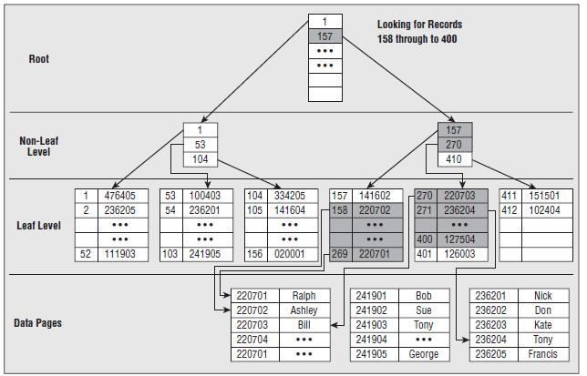

数据是以文件的形式存放在磁盘上面的，每一行数据都有它的磁盘地址。如果没有索引的话，我们要从500万行数据里面检索一条数据，只能依次遍历这张表的全部数据, 直到找到这条数据。但是我们有了索引之后，只需要在索引里面去检索这条数据就行了，因为它是一种 特殊的专门用来快速检索的数据结构，我们找到数据存放的磁盘地址以后，就可以拿到 数据了。

就像我们从一本500页的书里面去找特定的一小节的内容，肯定不可能从第一页开 始翻。那么这本书有专门的目录，它可能只有几页的内容，它是按页码来组织的，可以根 据拼音或者偏旁部首来查找，我们只要确定内容对应的页码，就能很快地找到我们想要 的内容。

### 索引类型

那在我们的数据表上面，我们怎么去创建一个索引呢？我们打开工具`Navicat`，右键设计表，在索引的这个选项卡里面，我们可以创建索引。

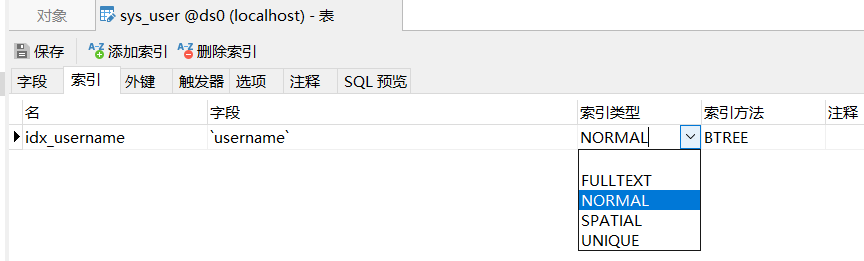

第一个是索引的名称，第二个是索引的列，比如我们是要对id创建索引还是对name创建索引。后面两个很重要，一个叫索引类型。在`InnoDB`里面，索引类型有四种，全文索引（`FULLTEXT`）普通索引（`NORMAL`）、空间索引（`SPATIAL`）、唯一索引（`UNIQUE`）。

>主键索引是特殊的唯一 索引。

普通(NORMAL)：也叫非唯一索引，是最普通的索引，没有任何的限制。

唯一 (UNIQUE)：唯一索弓|要求键值不能重复。另外需要注意的是，主键索引是一 种特殊的唯一索引，它还多了一个限制条件，要求键值不能为空，主键索引用primay key 创建。

全文(`FULLTEXT`)：针对比较大的数据，比如我们存放的是消息内容、一篇文章，有 几KB的数据的这种情况，如果要解决like査询在全文匹配的时候效率低的问题，可以创建全文索引。只有文本类型的字段才可以创建全文索引，比如`char`、`varchar`、`text`。

>语法：
>
>```mysql
>select * fiom table where match(content) against('test'IN NATURAL LANGUAGE MODE);
>```
>
>`MylSAM`和`InnoDB`支持全文索引。

### 索引存储模型推演

### 二分查找

《幸运52》有一个猜价格的游戏，限定时间之内猜中了就可以带回家。

在你报出价格之后主持人会告诉你低了还是高了如果价格在10000-30000之间，你会先猜多少？

一般人都会从2000开始猜。其实这个就是二分查找的一种思想，也叫折半查找，每一次，我们都把候选数据缩小了一半。如果数据已经排过序的话，这种方式效率比较高。 所以第一个,我们可以考虑用有序数组作为索引的数据结构。

**有序数组**的等值查询和比较查询效率非常高，但是更新数据的时候会出现一个问题, 可能要挪动大量的数据(改变index),所以只适合存储静态的数据。

为了支持频繁的修改，比如插入数据，我们需要采用链表，**链表**的话，如果是单链 表，它的查找效率还是不够高。

所以，有没有可以使用二分査找的链表呢？

为了解决这个问题，BST (Binary Search Tree)也就是我们所说的二叉査找树诞生了。

### 二叉查找树(BST Binary Search Tree)

**特点**：左子树所有的节点都小于父节点，右子树所有的节点都大于父节点。投影到平面以后，就是一个有序的线性表。

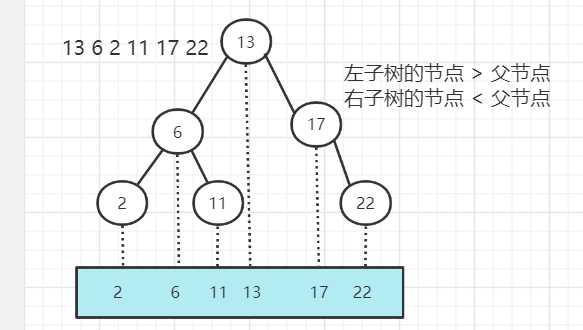

二叉查找树既能够实现快速查找，又能够实现快速插入。但是二叉查找树有一个问题：就是它的查找耗时是和这棵树的深度相关的，在最坏的情况下时间复杂度会退化成O(n)。

什么情况是最坏的情况呢？

还是刚才的这一批数字，如果我们插入的数据刚好是有序的，2、6、11、13、17、22。它会变成链表（我们把这种树叫做“斜树”），这种情况下不能达到加快检索速度的目的，和顺序查找效率是没有区别的。

造成它倾斜的原因是什么呢？

因为左右子树深度差太大，这棵树的左子树根本没有节点——也就是它不够平衡。所以，我们有没有左右子树深度相差不是那么大，更加平衡的树呢？这个就是平衡二叉树，叫做Balanced binary search trees，或者`AV`L树（`AVL`是发明这个数据结构的两位作者的名字简写：`G. M. Adelson-Velsky`和`E. M. Landis`）。

### 平衡二叉树（AVL Tree）（左旋、右旋）

`AVL` Trees （**Balanced** binary search trees）

平衡二叉树的**定义**：左右子树深度差绝对值不能超过1。

是什么意思呢？比如左子树的深度是2,右子树的深度只能是1或者3。

这个时候我们再按顺序插入1、2、3、4、5、6,—定是这样，不会变成一棵“斜树“

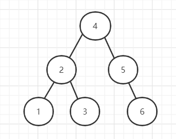

那它的平衡是怎么做到的呢？怎么保证左右子树的深度差不能超过1呢？

插入1、2、3。我们注意看：当我们插入了 1、2之后，如果按照二叉查找树的定义，3肯定是要在 2的右边的，这个时候根节点1的右节点深度会变成2,但是左节点的深度是0,因为它 没有子节点，所以就会违反平衡二叉树的定义。

那应该怎么办呢？因为它是右节点下面接一个右节点，右-右型，所以这个时候我们 要把2提上去，这个操作叫做左旋。

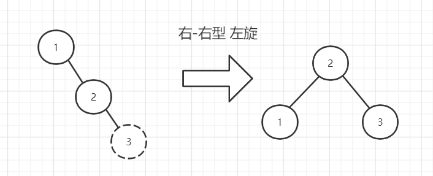

同样的，如果我们插入7、6、5,这个时候会变成左左型，就会发生右旋操作，把6提上去。
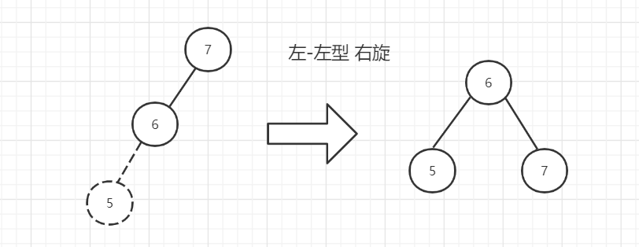

所以为了保持平衡，AVL树在插入和更新数据的时候执行了一系列的计算和调整的 操作。

平衡的问题我们解决了，那么平衡二叉树作为索引怎么査询数据?

在平衡二叉树中，一个节点，它的大小是一个固定的单位，作为索引应该存储什么内容？

前面我们已经知道了，索引必须要存你建立索引的字段的值，叫做键值，比如id的值。还要存完整记录在磁盘上的地址。由于AVL树是二叉树，所以还要额外地存储左右子树的指针。

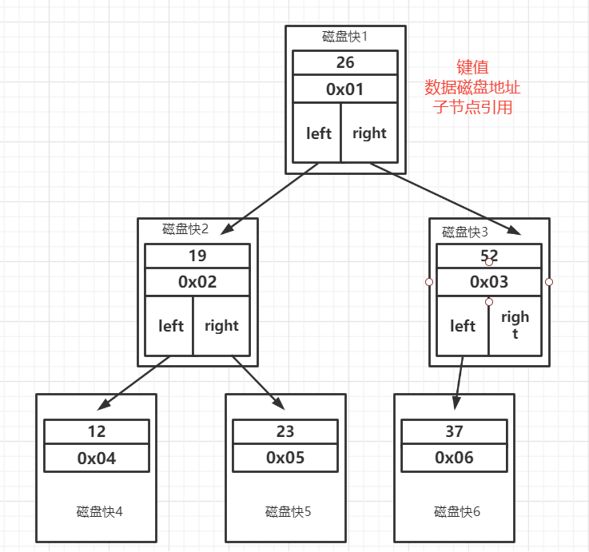

如图：

第一个是索引的键值。比如我们在id上面创建了一个索弓|,我在用where id =1的 条件查询的时候就会找到索引里面的id的这个键值。

第二个是数据的磁盘地址，因为索引的作用就是去查找数据的存放的地址。

第三个，因为是二叉树，它必须还要有左子节点和右子节点的引用，这样我们才能找到下一个节点。比如大于26的时候，走右边，到下一个树的节点，继续判断。

如果是这样存储数据的话，我们来看一下会有什么问题。

### AVL树用于存储索引数据

首先，索引的数据，是放在硬盘上的。查看数据和索引的大小：

```mysql
select
CONCAT(ROUND(SUM(DATA_LENGTH/1024/1024),2),'MB')  AS data_len, CONCAT(ROUND(SUM(INDEX_LENGTH/1024/1024),2),'MB') AS index_len 
       from information_schema.TABLES
where table_schema='test' and table_name='user_innodb';
```

当我们用树的结构来存储索引的时候，访问一个节点就要跟磁盘之间发生一次IO操作。`InnoDB`操作磁盘的最小的单位是一页(或者叫一个磁盘块)，大小是`16K`(16384 字节)。那么，一个树的节点必须设计成`16K`的大小，不然就会出现读不完或者读不够的情 况。如果我们一个节点只存一个键值+数据+引用，例如整形的字段，可能只用了十几个或者几十个字节，它远远达不到`16K`的容量。

因此，我们基于索引査找数据的时候，肯定是希望一次从磁盘加载很多的数据 到内存中进行比较，这样就可以尽快拿到完整的数据。如果一个节点只存1个这样的单元，就需要读更多的节点，发生更多的I/O操作。如果是机械硬盘时代，每次从磁盘读取数据需要`10ms`左右的寻址时间，交互次数 越多，消耗的时间就越多。

比如上面这张图，我们一张表里面有6条数据，当我们查询id = 66的时候，要查询 两个子节点，就需要跟磁盘交互3次，如果我们有几百万的数据呢？这个时间更加难以 估计。

我们怎么解决这个问题？

- 第一个就是让每个节点存储更多的数据。

- 第二个，节点上的关键字的数量越多，我们的指与十数也越多，也就是意味着可以有 更多的分叉（我们把它叫做"路数”）。

因为分叉数越多，树的深度就会减少（根节点是0）。这样，我们的树是不是从原来的高瘦高瘦的样子，变成了矮胖矮胖的样子？这个时候，我们的树就不再是二叉了，而是多叉，或者叫做多路。

### 多路平衡查找树（B Tree）（分裂、合并）

跟`AVL`树一样，B树在枝节点和叶子节点存储键值、数据地址、节点引用。

**特点**：分叉数（路数）永远比关键字数多1。比如我们画的这棵树，每个节 点存储两个关键字，那么就会有三个指针指向三个子节点（当然肯定不只存3个这么少）。

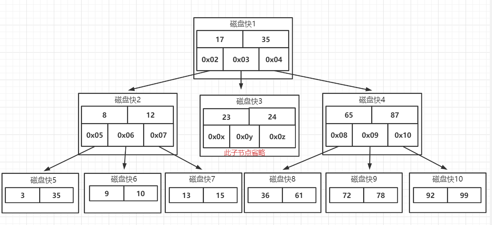

B Tree的查找规则

比如我们要在这张表里面查找15。因为15小于17,走左边。因为15大于12,走右边。在磁盘块7里面就找到了15，只用了 3次IO。

这个是不是比AVL树效率更高呢？

那B Tree又是怎么实现一个节点存储多个关键字，还保持平衡的呢？跟AVL树有什么区别？

比如Max Degree (路数)是3的时候，我们插入数据1、2、3,在插入3的时候, 本来应该在第一个磁盘块，但是如果一个节点有三个关键字的时候，意味着有4个指针, 子节点会变成4路，所以这个时候必须进行分裂。把中间的数据2提上去，把1和3变 成2的子节点。

如果删除节点，会有相反的合并的操作。

注意这里是分裂和合并，跟AVL树的左旋和右旋是不一样的。

我们继续插入4和5，B Tree又会出现分裂和合并的操作。

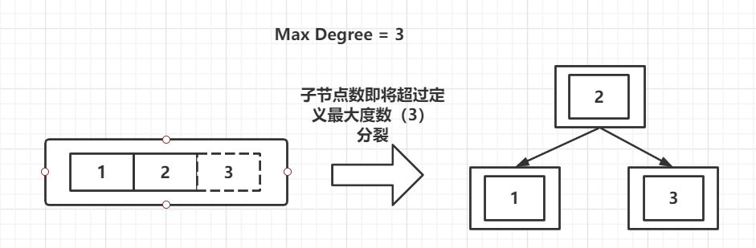

从这个里面我们也能看到，在更新索引的时候会有大量的索引的结构的调整，所以 解释了为什么我们不要在频繁更新的列上建索引，或者为什么不要更新主键。节点的分裂和合并，其实就是InnoDB页的分裂和合并。

如果索引键值有序，写满一页接着开辟一个新的页：

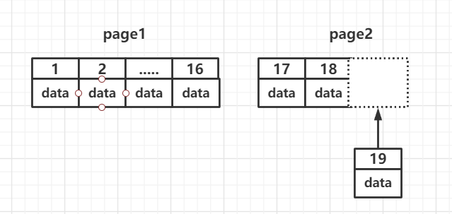

如果索引键值无序，存储过程造成大量磁盘碎片，带来频繁的page分裂和合并：

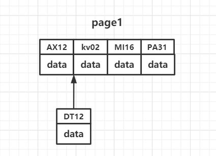

### B+树（加强版多路平衡查找树）

B Tree的效率已经很高了，为什么MySQL还要对B Tree进行改良，最终使用了B+Tree 呢？

总体上来说，这个B树的改良版本解决的问题比B Tree更全面。

我们来看一下InnoDB里面的B+树的存储结构：

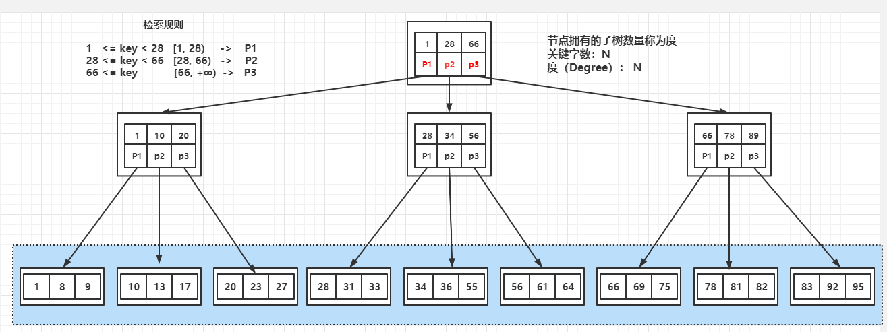

`MySQL`中的B+Tree有几个特点：

- 它的关键字的数量是跟路数相等的。

- B+Tree的根节点和枝节点中都不会存储数据，只有叶子节点才存储数据。 目前我们的认知：这里要存放的数据是什么？是完整记录的地址。搜索到关键字不会直接返回，会到最后一层的叶子节点。比如我们搜索id=28, 虽然在第一层直接命中了，但是全部的数据在叶子节点上面，所以我还要继续往下搜 索，一直到叶子节点。
- B+Tree的每个叶子节点增加了一个指向相邻叶子节点的指针，它的最后一个 数据会指向下一个叶子节点的第一个数据,形成了一个有序链表的结构。

我们来看一下B+Tree的数据搜寻过程：

- 比如我们要查找28,在根节点就找到了键值，但是因为它不是页子节点，所以 会继续往下搜寻，28是［28,66）的左闭右开的区间的临界值，所以会走中间的子节点，然 后继续搜索，它又是［28,34）的左闭右开的区间的临界值，所以会走左边的子节点，最后 在叶子节点上找到了需要的数据。

- 第二个，如果是范围查询，比如要查询从22到60的数据，当找到22之后，只 需要顺着节点和指针顺序遍历就可以一次性访问到所有的数据节点，这样就极大地提高 了区间查询效率（不需要返回上层父节点重复遍历查找）。

总结一下，`InnoDB`中的B+Tree特性带来的优势：

- 它是`BTree`的变种，`BTree`能解决的问题，它都能解决。B Tree解决的两大问题 是什么？（每个节点存储更多关键字；路数更多）。
- 扫库、扫表能力更强（如果我们要对表进行全表扫描，只需要遍历叶子节点就可以 了，不需要遍历整棵B+Tree拿到所有的数据）。
- B+Tree的磁盘读写能力相对于B Tree来说更强（根节点和枝节点不保存数据区, 所以一个节点可以保存更多的关键字，一次磁盘加载的关键字更多）。
- 排序能力更强（因为叶子节点上有下一个数据区的指针，数据形成了链表）。
- 效率更加稳定（B+Tree永远是在叶子节点拿到数据，所以IO次数是稳定的）。

我们举个例子：假设一条记录是`16bytes`, 一个叶子节点（一页）可以存储10条记 录。非叶子节点可以存储多少个指针？

假设索弓I字段+指针大小为16字节。非叶子节点（一页）可以存储1000个这样的 单元（键值+指针），代表有1000个指针。

树深度为2的时候，有1000^2个叶子节点，可以存储的数据为1000`*`1000`*`10=10000000 （千万级别）。

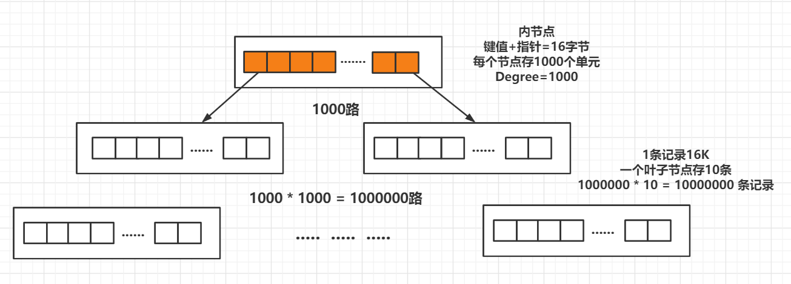

在査找数据时一次页的査找代表一次IO,也就是说，一张千万级别的表，査询数据 最多需要访问3次磁盘。

树的深度是怎么来的？根据你的键值类型和数据量计算出来的。字段值越大、数据 量越大，深度越大。

所以在`InnoDB`中B+树深度一般为1-3层，它就能满足千万级的数据存储。

### 为什么不用红黑树

红黑树也是BST树，但是不是严格平衡的，通过变色和旋转来保持平衡。必须满足5个约束：

- 节点分为红色或者黑色。
- 根节点必须是黑色的。
- 叶子节点都是黑色的`NULL`节点。
- 红色节点的两个子节点都是黑色（不允许两个相邻的红色节点）。
- 从任意节点出发，到其每个叶子节点的路径中包含相同数量的黑色节点。 插入：60、56、68、45、64、 58、72、43、49

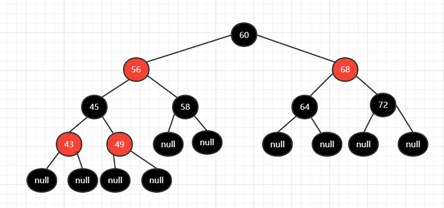

基于以上规则，可以推导出：从根节点到叶子节点的最长路径（红黑相间的路径）不大于最短路径（全部是黑色节点）的2倍。

为什么不用红黑树？ 1、只有两路；2、不够平衡。红黑树一般只放在内存里面用。例如Java的TreeMap，它可以用来实现一致性哈希。

### 索引方式：真的是用的B+Tree吗?

`Navicat`的工具中，创建索引，索引方式有两种。

HASH：以KV的形式检索数据，也就是说，它会根据索引字段生成哈希码和指针，指针指向数据。

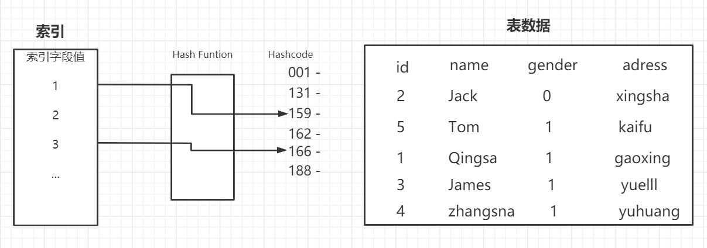


## B+Tree落地形式

### MySQL 架构

MySQL是一个支持插件式存储引擎的数据库，在MySQL里 面，每个表在创建的时候都可以指定它所使用的存储引擎。

### MySQL数据存储文件

MySQL的数据都是文件的形式存放在磁盘中的，我们可以找到这个数据目录的地址。在MySQL中有这么一个参数，我们来看一下：

```mysql
show VARIABLES LIKE 'datadir;
```

每个数据库有一个目录，我们新建了一个叫做`test`的数据库，那么这里就有一个`test`的文件夹。这个数据库里面我们又建了5张表：`archive`，`innodb`，`memory`，`myisam`，`csvo`。

我们进入`test`的目录，发现这里面有一些跟我们创建的表名对应的文件。在这里我们能看到，每张InnoDB的表有两个文件（.frm和.ibd） , MylSAM的表有三个文件（.frm、.MYD、,MYI）。有一个是相同的文件`.frm`，`.frm`是MySQL里面表结构定义的文件，不管你建表的时候选用任何一个存储引擎都会生成。

### MylSAM

在MylSAM里面，另外有两个文件：一个是`.MYD`文件，D代表Data,是MylSAM的数据文件，存放数据记录，比如我们的user myisam表的所有的表数据。一个是`.MYI`文件，I代表Index，是MylSAM的索引文件，存放索引，比如我们在 id字段上面创建了一个主键索引，那么主键索引就是在这个索引文件里面。一个索引就 会有一棵`B+Tree`,所有的`B+Tree`都在这个`.MYI`文件里面。也就是说，在MylSAM里面，索引和数据是两个独立的文件。MylSAM的`B+Tree`里面，叶子节点存储的是数据文件对应的磁盘地址。所以从索 引文件`.MYI`中找到键值后，会到数据文件`.MYD`中获取相应的数据记录。

>图

在`MylSAM`里面，其他的索引也在这个`.MYI`文件里面。

非主键索引跟主键索引存储和检索数据的方式是没有任何区别的，一样是在索引文 件里面找到磁盘地址，然后到数据文件里面获取数据。

>图

### InnoDB

在`InnoDB`的某个索引的叶子节点上，它直接存储了我们的数据。 所以，为什么说在`InnoDB`中索引即数据，数据即索引，就是这个原因。

但是这里会有一个问题，一张`InnoDB`的表可能有很多个多索引，数据肯定是只有—份的，那数据在哪个索引的叶子节点上呢？

>图

#### 聚簇索引

索引键值的逻辑顺序跟表数据行的物理存储顺序是一致的。`InnoDB`组织数据的方式就是（聚集）索引组织表（clustered index organize table）。如果说一张表创建了主键索引，那么这个主键索引就是聚集索引，决定数据行的物理存储顺序（比如字典的目录是按拼音排序的，内容也是按拼音排序的，按拼音排序的这种目 录就叫聚集索引）。

那主键索引之外的索引，会不会也把完整记录在叶子节点放一份呢？并不会，因为这会带来额外的存储空间浪费和计算消耗。它们的叶子节点上没有数据怎么检索完整数据？比如我们在name字段上面建的普通索引。

>图


`InnoDB`中，主键索引和辅助索引是有一个主次之分的。刚才我们讲了，如果有主键索引，那么主键索引就是聚集索引。其他的索引统一叫做`二级索引（secondary index）`。二级索引存储的是二级索引的键值，例如在name上建立索引，节点上存的是name 的值，qingshanmictom等等（很明显，它的键值逻辑顺序跟物理行的顺序不一致）。而二级索引的叶子节点存的是这条记录对应的主键的值。比如qingshan id = 1，jack id=4所以，二级索引检索数据的流程是这样的：

当我们用name索引查询一条记录，它会在二级索引的叶子节点找到 name=qingshan,拿到主键值，也就是id = 1,然后再到主键索引的叶子节点拿到数据。

为什么不存地址而是存键值？因为地址会变化。从这个角度来说，因为主键索引比二级索引少扫描了一棵B+Tree （避免了回表）， 它的速度相对会快一些。

但是，如果一张表没有主键怎么办？那完整的记录放在哪个索引的叶子节点？或者, 这张表根本没有索引呢？数据放在哪里？

- 如果我们定义了主键(PRIMARY KEY),那么`InnoDB`会选择主键作为聚集索弘
- 如果没有显式定义主键，则`InnoDB`会选择第一个不包含有NULL值的唯一索引 作为主键索引。
- 如果也没有这样的唯一索引，则`InnoDB`会选择内置6字节长的`ROWID`作为隐藏的聚集索引，它会随着行记录的写入而主键递增。

## 索引使用原则

### 列的离散度

第一个叫做列的离散度，我们先来看一下列的离散度的公式：count(distinct(column name))：count（*)，列的全部不同值和所有数据行的比例。数据行数相同的情况下，分子越大，列的离散度就越高。

数据行数相同的情况下，分子越大，列的离散度就越高。

按照这个定义，name的离散度更高，还是gender的离散度更高?

 

简单来说，如果列的重复值越多，离散度就越低，重复值越少，离散度就越高。

我们不建议大家在离散度低的字段上建立索引。

 

简单来说，如果列的重复值越多，离散度就越低，重复值越少，离散度就越高。

我们不建议大家在离散度低的字段上建立索引。

如果在B+Tree里面的重复值太多，MySQL的优化器发现走索引跟使用全表扫描差不了多少的时候，就算建了索引，也不一定会走索引。

### 联合索引最左匹配

前面我们说的都是针对单列创建的索引，但有的时候我们的多条件査询的时候，也会建立联合索引。单列索引可以看成是特殊的联合索引。比如我们在user表上面，给name和phone建立了一个联合索引。

```mysql
ALTER TABLE user_innodb DROP INDEX comidx_name_phone;
ALTER TABLE user_innodb ADD INDEX comidx_name_phone (name,phone);
```

联合索引在`B+Tree`中是复合的数据结构，它是按照从左到右的顺序来建立搜索树的 （name在左边，phone在右边）。

从这张图可以看岀来，name是有序的，phone是无序的。当name相等的时候， phone才是有序的。

这个时候我们使用`where name = 'test' and phone = '136xx'`去査询数据的时候，`B+Tree`会优先比较`name`来确定下一步应该搜索的方向，往左还是往右。如果`name`相同的时候再比较`phoneo`但是如果查询条件没有`name`,就不知道第一步应该查哪个 节点，因为建立搜索树的时候name是第一个比较因子，所以用不到索引。

所以，我们在建立联合索引的时候，一定要把最常用的列放在最左边。

比如下面的三条语句，大家觉得用到联合索引了吗？

- 使用两个字段，用到联合索引：

```mysql
EXPLAIN SELECT * FROM user_innodb WHERE name='test'AND phone = 45204661800';
```

- 使用左边的name字段，用到联合索引：

```mysql
EXPLAIN SELECT * FROM user_nnodb WHERE name='test'
```

- 使用右边的phone字段，无法使用索引，全表扫描：

```mysql
EXPLAIN SELECT * FROM user_innodb WHERE phone = '15204661800'
```

#### 如何创建联合索引

一个查询创建一个索引，所以我们针对这两条SQL创建了两个索引，这种做法觉得正确？

```mysql
CREATE INDEX idx_name on user_innodb(name);
CREATE INDEX idx_name_phone on user_innodb(name,phone);
```

当我们创建一个联合索引的时候，按照最左匹配原则，用左边的字段name去査询 的时候，也能用到索引，所以第一个索引完全没必要。

相当于建立了两个联合索引(name)，(name,phone)。如果我们创建三个字段的索引index(a,b,c),相当于创建三个索引：index(a)，index(a,b)，index(a/b/c)。用`where b=？和where b=? and c=?`是不能使用到索引的。

### 覆盖索引

回表：非主键索引，我们先通过索引找到主键索引的键值，再通过主键值查出索引里面没有的数据，它比基于主键索引的查询多扫描了一棵索引树，这个过程就叫回表。

```mysql
select * from user_innodb where name = 'Will';
```

>图

在二级索引里面，不管是单列索引还是联合索引，如果select的数据列只用从索引中就能够取到，不必从数据区中读取，这时候使用的索引就叫做覆盖索引，这样就避免 了回表。首先创建一个联合索引；

```mysql
# 创建联合索引
ALTER TABLE user_innodb DROP INDEX comixd_name_phone;
CREATE INDEX comixd_name_phone ON user_innodb (name, phone);
# alter table user_innodb add index comixd_name_phone (name, phone);
```

Extra里面值为"Using index”代表属于覆盖索引的情况。


这三个查询语句属于覆盖索引：

```mysql
EXPLAIN SELECT name,phone FROM user_innodb WHERE name ='test' AND phone = '13666666666';

EXPLAIN SELECT name FROM user_innodb WHERE name = '青山' AND phone = '113666666666';

EXPLAIN SELECT phone FROM user_innodb WHERE name = '青山' AND phone = '13666666666';
```

> select * ，不是覆盖索引。

如果改成只用where phone =査询呢？按照我们之前的分析，它是用不到索引的。实际上可以用到覆盖索引，优化器觉得用索引更快，所以还是用到了索引。很明显，因为覆盖索引减少了I/O次数，减少了数据的访问量，可以大大地提升查询效率。

### 索引条件下推（`ICP`）

索引条件下推(Index Condition Pushdown) ，`5.6`以后完善的功能。只适用于二级索引。`ICP`的目标是减少访问表的完整行的读数量从而减少I/O操作。这里说的下推，其实是意思是把过滤的动作在存储引擎做完，而不需要到Server层过滤。再来看这么一张表，在`last_name`和`first_name`上面创建联合索引。

```mysql
drop table if exists employees;
create table employees
(
    emp_no     int(11) auto_increment NOT NULL,
    birth_date date                   NULL,
    first_name varchar(14)            NOT NULL,
    last_name  varchar(16)            NOT NULL,
    gender     enum ('M','F')         NOT NULL,
    hire_date  date                   NULL,
    PRIMARY KEY (emp_no)
) ENGINE = InnoDB
  DEFAULT CHARSET = latin1;

alter table employees
    add index idx_lastname_firstname (last_name, first_name);

INSERT INTO employees(birth_date, first_name, last_name, gender, hire_date)
VALUES (current_date, '698', 'liu', 'F', current_date);
INSERT INTO employees(birth_date, first_name, last_name, gender, hire_date)
VALUES (NULL, 'd99', 'zheng', 'F', NULL);
INSERT INTO employees(birth_date, first_name, last_name, gender, hire_date)
VALUES (NULL, 'e08', 'liuang', 'F', NULL);
INSERT INTO employees(birth_date, first_name, last_name, gender, hire_date)
VALUES (NULL, ' 59d', 'lu', 'F', NULL);
INSERT INTO employees(birth_date, first_name, last_name, gender, hire_date)
VALUES (NULL, '989', 'yu', 'F', NULL);
```

现在我们要査询所有姓`wang`，并且名字最后一个字是`zi`的员工，比如王胖子，王瘦子。查询的SQL：

```mysql
select * from employees where last_name = 'wang' and first_name LIKE '%zi';
```

正常情况来说，因为字符是从左往右排序的，当你把`％`加在前面的时候，是不能基于 索引去比较的，所以只有`last_name `（姓）这个字段能够用于索引比较和过滤。

所以查询过程是这样的：

- 根据联合索引查出所有姓`wang`的二级索引数据（3个主键值：6、7、8）。
-  回表，到主键索引上查询全部符合条件的数据（3条数据）。
- 把这3条数据返回给Server层，在Server层过滤出名字以`zi`结尾的员工。

>图


## 索引的创建与使用

### 索引创建

- 在用于where判断order排序和join的(on)、group by的字段上创建索引
- 索引的个数不要过多。（浪费空间，更新变慢）
- 过长的字段，建立前缀索引。

```mysql
CREATE TABLE 'pre_test'
(
    'content' varchar(20) DEFAULT NULL,
    KEY ' pre_idx' ('content' (6))
) ENGINE = InnoDB
  DEFAULT CHARSET = utf8mb4;
```

- 区分度低的字段，例如性别，不要建索引。（离散度太低，导致扫描行数过多）
- 频繁更新的值，不要作为主键或者索引。（页分裂）
- 随机无序的值，不建议作为索引，例如身份证、`UUID`。（无序，分裂）
- 组合索引把散列性高(区分度高)的值放在前面。
- 创建复合索引，而不是修改单列索引。

### 索引失效

- 索引列上使用函数(`replace`\`substr`\`concat`\`sum` `count` `avg`)、表达式计算(`+`  `-` `*` `/`)：

  ```mysql
  explain SELECT * FROM t2 where id+1 = 4;
  ```

- 字符串不加引号，出现隐式转换

  ```mysql
  ALTER TABLE user_innodb DROP INDEX comidx_name_hone;
  ALTER TABLE user innodb add INDEX comidx_name_phone (name,phone);
  
  explain SELECT * FROM user_innodb where name = 136;
  explain SELECT * FROM user_innodb where name = '136';
  ```

- `like`条件中前面带`%`，`where`条件中`like abc%`，`like %2673%`, `like %888`都用不到索引吗？为什么?

  ```mysql
  explain select * from user_innodb where name like 'wang%';
  explain select * from user_innodb where name like '%wang';
  ```

  >过滤的开销太大。这个时候可以用全文索引。

- 负向查询

  - `NOT LIKE`不能：

  ```mysql
  explain select * from employees where last_name not like 'wang';
  ```

  - `(<>)`和`NOT IN`在某些情况下可以:

  ```mysql
  explain select * from employees where emp_no not in (1);
  explain select * from employees where emp_no <> 1;
  ```

  >这个例子中，因为索引是有序的，只要从1之后开始顺序读取就行了。


注意跟数据库版本、数据量、数据选择度都有关系。其实，用不用索引，最终都是优化器说了算。

优化器是基于什么的优化器呢？

基于 cost 开销(Cost Base Optimizer)，它不是基于规则(Rule-Based Optimizer),，也不是基于语义。怎么样开销小就怎么来。

使用索引有基本原则，但是没有具体细则，没有什么情况一定用索引，什么情况一 定不用索引的规则。


## Q & A

### Q1：哈希索引有什么特点呢？

- 它的时间复杂度是o(1),査询速度比较快。因为哈希索引里面的数据不是按顺序存储的，所以不能用于排序。

- 我们在查询数据的时候要根据键值计算哈希码，所以它只能支持等值查询 (=IN)，不支持范围查询（`>` `<` `>=` `<=` `between` `and`）。

- 如果字段重复值很多的时候，会出现大量的哈希冲突(采用拉链法解 决)，效率会降低。

> 在InnoDB中，不能显式地创建一个哈希索引（所谓的支持哈希索 引指的是AHI,自适应哈希，它是InnoDB自动为buffer pool中的热点页创建的索引）。memory存储引擎可以使用Hash索引。

