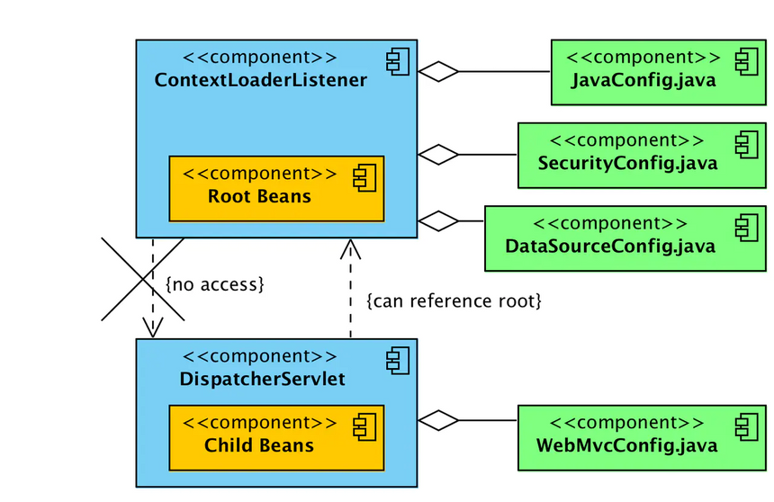
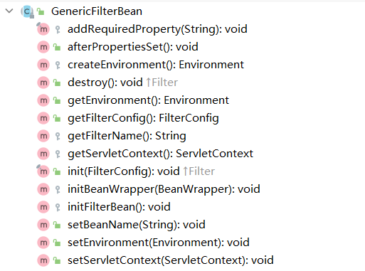

title: Java Security & Spring Security

---

# Java Security

[Java Security Architecture](https://docs.oracle.com/javase/8/docs/technotes/guides/security/spec/security-specTOC.fm.html)

## JDK 内建权限 API

- **[java.security.Permission](https://docs.oracle.com/javase/8/docs/technotes/guides/security/spec/security-spec.doc3.html#a19902)**
- **[java.security.PermissionCollection](https://docs.oracle.com/javase/8/docs/technotes/guides/security/spec/security-spec.doc3.html#a19905)**
- **[java.security.Permissions](https://docs.oracle.com/javase/8/docs/technotes/guides/security/spec/security-spec.doc3.html#a19911)**
- **[java.security.UnresolvedPermission](https://docs.oracle.com/javase/8/docs/technotes/guides/security/spec/security-spec.doc3.html#a22515)**
- **[java.io.FilePermission](https://docs.oracle.com/javase/8/docs/technotes/guides/security/spec/security-spec.doc3.html#a19913)**
- **[java.net.SocketPermission](https://docs.oracle.com/javase/8/docs/technotes/guides/security/spec/security-spec.doc3.html#a19915)**
- **[java.security.BasicPermission](https://docs.oracle.com/javase/8/docs/technotes/guides/security/spec/security-spec.doc3.html#a20057)**
- **[java.util.PropertyPermission](https://docs.oracle.com/javase/8/docs/technotes/guides/security/spec/security-spec.doc3.html#a20107)**
- **[java.lang.RuntimePermission](https://docs.oracle.com/javase/8/docs/technotes/guides/security/spec/security-spec.doc3.html#a20113)**
- **[java.awt.AWTPermission](https://docs.oracle.com/javase/8/docs/technotes/guides/security/spec/security-spec.doc3.html#a20327)**
- **[java.net.NetPermission](https://docs.oracle.com/javase/8/docs/technotes/guides/security/spec/security-spec.doc3.html#a20353)**
- **[java.lang.reflect.ReflectPermission](https://docs.oracle.com/javase/8/docs/technotes/guides/security/spec/security-spec.doc3.html#a26158)**
- **[java.io.SerializablePermission](https://docs.oracle.com/javase/8/docs/technotes/guides/security/spec/security-spec.doc3.html#a26159)**
- **[java.security.SecurityPermission](https://docs.oracle.com/javase/8/docs/technotes/guides/security/spec/security-spec.doc3.html#a26196)**
- **[java.security.AllPermission](https://docs.oracle.com/javase/8/docs/technotes/guides/security/spec/security-spec.doc3.html#a26221)**
- **[javax.security.auth.AuthPermission](https://docs.oracle.com/javase/8/docs/technotes/guides/security/spec/security-spec.doc3.html#AuthPermission)**

## JDK 安全策略配置文件

- 文件路径：$JAVA_HOME/jre/lib/security/java.policy

```bash
grant codeBase "file:${{java.ext.dirs}}/*" { permission java.security.AllPermission; };
```

- 格式：permission ${java.security.Permission 实现类} "${[permisson.name](http://permisson.name)}";

```bash
grant { 
		permission java.lang.RuntimePermission "stopThread";
		java.net.SocketPermission "localhost:0", "listen";
		permission java.util.PropertyPermission "java.version", "read"; 
}
```

> java.ext.dirs 系统属性表示JVM 扩展的 ClassLoader 路径
>
> - Bootstrap ClassLoader
>   - System ClassLoader
>     - App ClassLoader
>       - Ext ClassLoader（ JDK 9 开始淘汰）

## 激活安全管理器 - SecurityManager

```java
System.setSecurityManager(new SecurityManager());
```

## 自定义权限的 API

- Java 安全校验方法
  - `SecurityManager#checkPermission(java.security.Permission);`
  - `java.security.AccessController#checkPermission(java.security.Permission)`
- Java 鉴权方法
  - `java.security.AccessController#doPrivileged(java.security.PrivilegedAction)` 以及重载

## 第三方拓展

[Security Manager HOW-TO](http://tomcat.apache.org/tomcat-7.0-doc/security-manager-howto.html)

### Tomcat 自定义 Policy 文件

- 位置：$CATALINA_HOME/conf/catalina.policy 中

# Spring Security

[Spring Security Reference](https://docs.spring.io/spring-security/site/docs/5.4.6/reference/html5/#servlet-architecture)

### 设计模式

基于拦截模式实现，比如利用 AOP，Servlet Filter

## Servlet Filter


Servlet filter 调用链路根据 Filter 的顺序依次调用。传入参数为

- HttpServletRequest
- HttpServletResponse
- FilterChain

Filter 的两个作用如下：

- 对调用链路做拦截，可阻止不必要的请求进入下游 Filter 或 Servlet
- 修改下游 Filter 或 Servlet 使用的 HttpServletRequest 或 HttpServletResponse

```java
public void doFilter(ServletRequest request, ServletResponse response, FilterChain chain) {
    // do something before the rest of the application
    chain.doFilter(request, response); // invoke the rest of the application
    // do something after the rest of the application
}
```

## Spring Web DelegatingFilterProxy

### 说明

DelegatingFilterProxy 是 Spring Web 为应用提供的用于桥接 Servlet Filter组件和 Spring Filter Bean 的管道。

实际的 Filter 为

- bean name 为 targetBeanName 的 Spring Filter Bean

或

- Servlet Filter 对象 delegate

### 配置方式

- Servlet 标准方式，不会触发 Spring Bean 的生命周期

  - web.xml

  - Servlet 3.0+ 的注解驱动

  - Servlet 3.0+ 的 API 编程

    ```xml
    <filter>
        <filter-name>DelegatingFilterProxy</filter-name>
        <filter-class>org.springframework.web.filter.DelegatingFilterProxy</filter-class>
        <init-param>
            <param-name>targetBeanName</param-name>
            <param-value>someFilter</param-value>
        </init-param>
      </filter>
    ```

- Spring Bean 定义的方式定义 DelegatingFilterProxy，会触发 Spring Bean 的生命周期，不会触发 Filter 的 `init()`方法

### 初始化

```
initFilterBean()
protected void initFilterBean() throws ServletException {
		synchronized (this.delegateMonitor) {
			// 判断 Filter 对象是否为空，如果不为空则跳过
			if (this.delegate == null) {
				// 如果 Filter 对象为空，则获取 targetBeanName
				if (this.targetBeanName == null) {
          // 获取 target bean name, 先从 filterConfig 中获取 filter name，如果 filterConfig 为空则使用 GenericFilterBean#beanName
					this.targetBeanName = getFilterName();
				}
        // 获取 WebApplicationContext 
				WebApplicationContext wac = findWebApplicationContext();
				if (wac != null) {
					// 根据名称和类型查找 Filter
					this.delegate = initDelegate(wac);
				}
			}
		}
	}
findWebApplicationContext()
protected WebApplicationContext findWebApplicationContext() {
		if (this.webApplicationContext != null) {
			// 如果用户自己加入的 webApplicationContext 
			if (this.webApplicationContext instanceof ConfigurableApplicationContext) {
				ConfigurableApplicationContext cac = (ConfigurableApplicationContext) this.webApplicationContext;
				if (!cac.isActive()) {
					// 则刷新当前容器
					cac.refresh();
				}
			}
			return this.webApplicationContext;
		}
    // 从 ServletContext 中获取 WebApplicationContext
		String attrName = getContextAttribute();
		if (attrName != null) {
			return WebApplicationContextUtils.getWebApplicationContext(getServletContext(), attrName);
		}
		else {
			return WebApplicationContextUtils.findWebApplicationContext(getServletContext());
		}
	}
initDelegate(WebApplicationContext wac)
protected Filter initDelegate(WebApplicationContext wac) throws ServletException {
    // 根据 bean name 和 Filter 类型依赖查找 WebApplicationContext
		String targetBeanName = getTargetBeanName();
		Assert.state(targetBeanName != null, "No target bean name set");
		Filter delegate = wac.getBean(targetBeanName, Filter.class);
		if (isTargetFilterLifecycle()) {
			// 显示调用 Filter 的 init() 方法
			delegate.init(getFilterConfig());
		}
		return delegate;
	}
```

- 判断 delegate 的 Filter 对象是否存在，如果补存在则执行下一步
- 判断 targetBeanName 是否存在，存在则通过名称 + 类型的方式查找 Filter 并赋值给 delegate
  - 获取 WebApplicationContext 依赖于 ContextLoaderListener 或 DispatcherServlet

### ContextLoaderListener V.S DispatcherServlet

- ContextLoaderListener  Root WebApplicationContext
- DispatcherServlet Child WebApplicationContext
- DispatcherServlet 本质是一个 Servlet，它拓展了 HttpServlet，每个 DispatcherServlet 定义了一个Spring web Application 并都与 WebApplicationContext 相关
- ContextLoaderListener 为 Spring 对 Servlet 监听器的封装，本质上还是 Servlet 监听器，它创建一个根应用程序上下文（ApplicationContext）,并与所有的 DispatcherServlet 上下创建的上下文共享
- 在Spring Web应用程序中，有两种类型的容器，ApplicationContext 和 WebApplicationContext
- ApplicationContext 是由 ContextLoaderListener 创建并配置的或 web.xml
- 而 WebApplicationContext 是 ApplicationContext 的子上下文环境。是由 DispatcherServlet 启动时创建配置的
- 如果 web 应用程序没有配置 Listener，只配置了DispatcherServlet，web 容器启动时不会初始化 Spring Web 上下文，因为 Spring Web 是基于 Spring，没有配置Spring，所以也不会启动它的子上下文Spring Web



- `ContextLoaderListener` 创建根应用程序上下文
- `DispatcherServlet` 条目为每个 servlet 条目创建一个子应用程序上下文
- 子上下文可以访问根上下文中定义的 bean
- 根上下文中的 Bean 无法直接访问子上下文中的 bean
- 所有上下文都被添加到 ServletContext
- 可以使用 `WebApplicationContextUtils` 类访问根上下文

## Spring Web GenericFilterBean

### 类图


- EnvironmentAware Environment 回调
- EnvironmentCapable 创建配置 Environment
- ServletContextAware ServletContext 回调
- BeanNameAware bean name 回调
- InitializingBean 初始化 Bean
- DisposableBean 销毁 bean
- 实现 Filter ，可利用标准 Servlet Filter 的生命周期

通过上面的实现可看出，GenericFilterBean 可被以下两个方式之一管理生命周期

- 标准 Servlet 容器
  - Filter#init()
    - initFilterBean() 模板方法
  - Filter#destroy()
- Spring IoC 容器
  - InitializingBean#afterPropertiesSet()
    - initFilterBean() 模板方法
  - DisposableBean#destroy()

### 主要方法



### 实现特点

- 通常拓展 GenericFilterBean 的类并非传统的 Spring Bean，但它需要 Spring Bean 的生命周期
- GenericFilterBean 的实现往往是通过 web.xml 文件或 Servlet 3.0+ 注解或 API 注册
- 属性的绑定通过 FilterConfig

### 初始化方法

```java
public final void init(FilterConfig filterConfig) throws ServletException {
		Assert.notNull(filterConfig, "FilterConfig must not be null");

		this.filterConfig = filterConfig;

		// 将 FilterConfig 配置属性转为 Spring PropertyValues
		PropertyValues pvs = new FilterConfigPropertyValues(filterConfig, this.requiredProperties);
		if (!pvs.isEmpty()) {
			try {
				// 获取给定目标对象的 BeanWrapper
				BeanWrapper bw = PropertyAccessorFactory.forBeanPropertyAccess(this);
				// 生成 ResourceLoader
				ResourceLoader resourceLoader = new ServletContextResourceLoader(filterConfig.getServletContext());
				Environment env = this.environment;
				if (env == null) {
					env = new StandardServletEnvironment();
				}
				bw.registerCustomEditor(Resource.class, new ResourceEditor(resourceLoader, env));
				// 交于子类定制 BeanWrapper
				initBeanWrapper(bw);
				// 将 PropertyValues 注入到属性
****				bw.setPropertyValues(pvs, true);
			}
			catch (BeansException ex) {
				String msg = "Failed to set bean properties on filter '" +
					filterConfig.getFilterName() + "': " + ex.getMessage();
				logger.error(msg, ex);
				throw new NestedServletException(msg, ex);
			}
		}

		// 模板方法，交于子类实现
		initFilterBean();

		if (logger.isDebugEnabled()) {
			logger.debug("Filter '" + filterConfig.getFilterName() + "' configured for use");
		}
	}
```

## Spring Security FilterChainProxy

### 说明

FilterChainProxy 是 Spring Security 提供的一个特殊的 Filter，它允许通过 SecurityFilterChain 委托给许多 Filter，FilterChainProxy 是一个 Bean，通常被 DelegatingFilterProxy 包装。

### 代码结构

```
doFilter()
@Override
	public void doFilter(ServletRequest request, ServletResponse response, FilterChain chain)
			throws IOException, ServletException {
		boolean clearContext = request.getAttribute(FILTER_APPLIED) == null;
		if (!clearContext) {
			// 将 HttpServletRequest、HttpServletResponse、FilterChain 委托给 SecurityFilterChain 的 Filters 处理
			doFilterInternal(request, response, chain);
			return;
		}
		try {
			request.setAttribute(FILTER_APPLIED, Boolean.TRUE);
			doFilterInternal(request, response, chain);
		}
		catch (RequestRejectedException ex) {
			this.requestRejectedHandler.handle((HttpServletRequest) request, (HttpServletResponse) response, ex);
		}
		finally {
			// 释放 ThreadLocal
			SecurityContextHolder.clearContext();
			request.removeAttribute(FILTER_APPLIED);
		}
	}
doFilterInternal(HttpServletRequest ,HttpServletResponse, FilterChain)
private void doFilterInternal(ServletRequest request, ServletResponse response, FilterChain chain)
			throws IOException, ServletException {
		// 装饰器模式装饰 HttpServletRequest
		FirewalledRequest firewallRequest = this.firewall.getFirewalledRequest((HttpServletRequest) request);
		HttpServletResponse firewallResponse = this.firewall.getFirewalledResponse((HttpServletResponse) response);
		// 获取 http 请求路径匹配到的 SecurityFilterChain 中的 Filters
		List<Filter> filters = getFilters(firewallRequest);
		if (filters == null || filters.size() == 0) {
			if (logger.isTraceEnabled()) {
				logger.trace(LogMessage.of(() -> "No security for " + requestLine(firewallRequest)));
			}
			firewallRequest.reset();
			chain.doFilter(firewallRequest, firewallResponse);
			return;
		}
		if (logger.isDebugEnabled()) {
			logger.debug(LogMessage.of(() -> "Securing " + requestLine(firewallRequest)));
		}
		VirtualFilterChain virtualFilterChain = new VirtualFilterChain(firewallRequest, chain, filters);
		// 委派依次调用 doFilter
		virtualFilterChain.doFilter(firewallRequest, firewallResponse);
	}
getFilters(HttpServletRequest request)
private List<Filter> getFilters(HttpServletRequest request) {
		int count = 0;
		for (SecurityFilterChain chain : this.filterChains) {
			if (logger.isTraceEnabled()) {
				logger.trace(LogMessage.format("Trying to match request against %s (%d/%d)", chain, ++count,
						this.filterChains.size()));
			}
			// 过滤请求，获取到与当前请求相匹配的 SecurityFilterChain
			if (chain.matches(request)) {
				// 直接返回匹配到的 Filters
				return chain.getFilters();
			}
		}
		return null;
	}
```

### Spring Security SecurityFilterChain


- FilterChainProxy 使用 SecurityFilterChain 来确定应该为此请求调用哪个 Spring Security Filter
- SecurityFilterChain 中的 Security Filter 通常是 bean，但它们是通过 FilterChainProxy 而不是 DelegatingFilterProxy 注册的
- 每个 SecurityFilterChain 可以是唯一的，并且可以隔离配置

```
SecurityFilterChain` 唯一实现类 `org.springframework.security.web.DefaultSecurityFilterChain
```

`DefaultSecurityFilterChain`关联对象

- `org.springframework.security.web.util.matcher.RequestMatcher` http 请求匹配规则
- `List<Filter>` Filter 对象列表

`DefaultSecurityFilterChain` 的构建方式

- ```
  org.springframework.security.config.annotation.web.builders.HttpSecurity
  ```

  - `SecurityBuilder<DefaultSecurityFilterChain>`

### SecurityBuilder 的设计模式

- 采用泛型参数来决定构建对象的类型，如

  - `org.springframework.security.config.annotation.web.builders.HttpSecurity`

  ```java
  public final class HttpSecurity extends AbstractConfiguredSecurityBuilder<DefaultSecurityFilterChain, HttpSecurity>
  		implements SecurityBuilder<DefaultSecurityFilterChain>, HttpSecurityBuilder<HttpSecurity>
  ```

  - `org.springframework.security.config.annotation.web.builders.WebSecurity`

  ```java
  public final class WebSecurity extends AbstractConfiguredSecurityBuilder<Filter, WebSecurity>
  		implements SecurityBuilder<Filter>, ApplicationContextAware
  ```

- ```
  org.springframework.security.config.annotation.AbstractSecurityBuilder#build
  ```

  - 模板方法 `org.springframework.security.config.annotation.AbstractSecurityBuilder#doBuild`

- ```
  org.springframework.security.config.annotation.AbstractConfiguredSecurityBuilder#doBuild
  ```

   中涵盖了 build 的构建周期

  - 初始化前 `beforeInit()` - 模板方法

  - 初始化 

    ```
    init()
    ```

    - 迭代 `SecurityConfigurer#init(SecurityBuilder)` 方法

  - 配置前 `beforeConfigure()` - 模板方法

  - 配置

    ```
    configure()
    ```

    - 迭代 `SecurityConfigurer#configure(SecurityBuilder)`方法
    - 其中被迭代的 `SecurityConfigure` 基本为 `WebSecurityConfigurerAdapter` 的 Bean

  - 构建 `O result = performBuild()` - 模板方法

## 委托关系


### SecurityFilterChain 选择


### 说明

- DelegatingFilterProxy 不一定为标准 Spring Bean
- FilterChainProxy 一定是 Spring 标准 Bean
- FilterChainProxy 扩展 GenericFilterBean 实现，意味着FilterChainProxy 是通过 Spring Bean 生命周期来初始化依赖的组件
- FilterChainProxy 与 SecurityFilterChain 的关联关系为1:N，一个SecurityFilterChain 关联了 M 个 Filter 实现

### 注

每个 SecurityFilterChain 中的 Filters 都有一个固定顺序，控制顺序的类为 `org.springframework.security.config.annotation.web.builders.FilterComparator`

```java
FilterComparator() {
		Step order = new Step(INITIAL_ORDER, ORDER_STEP);
		put(ChannelProcessingFilter.class, order.next());
		order.next(); // gh-8105
		put(WebAsyncManagerIntegrationFilter.class, order.next());
		put(SecurityContextPersistenceFilter.class, order.next());
		put(HeaderWriterFilter.class, order.next());
		put(CorsFilter.class, order.next());
		put(CsrfFilter.class, order.next());
		put(LogoutFilter.class, order.next());
		this.filterToOrder.put(
				"org.springframework.security.oauth2.client.web.OAuth2AuthorizationRequestRedirectFilter",
				order.next());
		this.filterToOrder.put(
				"org.springframework.security.saml2.provider.service.servlet.filter.Saml2WebSsoAuthenticationRequestFilter",
				order.next());
		put(X509AuthenticationFilter.class, order.next());
		put(AbstractPreAuthenticatedProcessingFilter.class, order.next());
		this.filterToOrder.put("org.springframework.security.cas.web.CasAuthenticationFilter", order.next());
		this.filterToOrder.put("org.springframework.security.oauth2.client.web.OAuth2LoginAuthenticationFilter",
				order.next());
		this.filterToOrder.put(
				"org.springframework.security.saml2.provider.service.servlet.filter.Saml2WebSsoAuthenticationFilter",
				order.next());
		put(UsernamePasswordAuthenticationFilter.class, order.next());
		order.next(); // gh-8105
		this.filterToOrder.put("org.springframework.security.openid.OpenIDAuthenticationFilter", order.next());
		put(DefaultLoginPageGeneratingFilter.class, order.next());
		put(DefaultLogoutPageGeneratingFilter.class, order.next());
		put(ConcurrentSessionFilter.class, order.next());
		put(DigestAuthenticationFilter.class, order.next());
		this.filterToOrder.put(
				"org.springframework.security.oauth2.server.resource.web.BearerTokenAuthenticationFilter",
				order.next());
		put(BasicAuthenticationFilter.class, order.next());
		put(RequestCacheAwareFilter.class, order.next());
		put(SecurityContextHolderAwareRequestFilter.class, order.next());
		put(JaasApiIntegrationFilter.class, order.next());
		put(RememberMeAuthenticationFilter.class, order.next());
		put(AnonymousAuthenticationFilter.class, order.next());
		this.filterToOrder.put("org.springframework.security.oauth2.client.web.OAuth2AuthorizationCodeGrantFilter",
				order.next());
		put(SessionManagementFilter.class, order.next());
		put(ExceptionTranslationFilter.class, order.next());
		put(FilterSecurityInterceptor.class, order.next());
		put(SwitchUserFilter.class, order.next());
	}
```

## Spring Security 构建器 WebSecurity &  HttpSecurity

- `HttpSecurity` 用于定义某些需要安全过滤的请求，也可以定义某些请求不需要安全过滤
- `WebSecurity` 通过 `HttpSecurity` 定义请求安全过滤，也可通过其他方式忽略某些请求
- `WebSecurity` 面向整个 Spring Security , `HttpSecurity` 仅是其一部分
- `WebSecurity` 构建的是整个 Spring Security 的 `FilterChainProxy`
- `HttpSecurity` 构建的是 `FilterChainProxy` 中的一个 `SecurityFilterChain` ，如果需要构建多个 `SecurityFilterChain` 时，需生成多个 `HttpSecurity`

## Spring Security 装配

### XML 解析和装配

```
org.springframework.security.config.http.HttpSecurityBeanDefinitionParser#registerFilterChainProxyIfNecessary
static void registerFilterChainProxyIfNecessary(ParserContext pc, Object source) {
		BeanDefinitionRegistry registry = pc.getRegistry();
		if (registry.containsBeanDefinition(BeanIds.FILTER_CHAIN_PROXY)) {
			return;
		}
		// Not already registered, so register the list of filter chains and the
		// FilterChainProxy
		BeanDefinition listFactoryBean = new RootBeanDefinition(ListFactoryBean.class);
		listFactoryBean.getPropertyValues().add("sourceList", new ManagedList());
		pc.registerBeanComponent(new BeanComponentDefinition(listFactoryBean, BeanIds.FILTER_CHAINS));
		// 构建 FilterChainProxy 对象的 BeanDefinitionBuilder
		BeanDefinitionBuilder fcpBldr = BeanDefinitionBuilder.rootBeanDefinition(FilterChainProxy.class);
		// 属性填充
		fcpBldr.getRawBeanDefinition().setSource(source);
		fcpBldr.addConstructorArgReference(BeanIds.FILTER_CHAINS);
		fcpBldr.addPropertyValue("filterChainValidator", new RootBeanDefinition(DefaultFilterChainValidator.class));
		BeanDefinition fcpBean = fcpBldr.getBeanDefinition();
		pc.registerBeanComponent(new BeanComponentDefinition(fcpBean, BeanIds.FILTER_CHAIN_PROXY));
		registry.registerAlias(BeanIds.FILTER_CHAIN_PROXY, BeanIds.SPRING_SECURITY_FILTER_CHAIN);
		BeanDefinitionBuilder requestRejected = BeanDefinitionBuilder
				.rootBeanDefinition(RequestRejectedHandlerPostProcessor.class);
		requestRejected.setRole(BeanDefinition.ROLE_INFRASTRUCTURE);
		requestRejected.addConstructorArgValue("requestRejectedHandler");
		requestRejected.addConstructorArgValue(BeanIds.FILTER_CHAIN_PROXY);
		requestRejected.addConstructorArgValue("requestRejectedHandler");
		AbstractBeanDefinition requestRejectedBean = requestRejected.getBeanDefinition();
    // 生成 bean name
		String requestRejectedPostProcessorName = pc.getReaderContext().generateBeanName(requestRejectedBean);
		// 注册 bean
		registry.registerBeanDefinition(requestRejectedPostProcessorName, requestRejectedBean);
	}
```

### 自动装配

```
org.springframework.security.web.context.AbstractSecurityWebApplicationInitializer#insertSpringSecurityFilterChain
private void insertSpringSecurityFilterChain(ServletContext servletContext) {
		String filterName = DEFAULT_FILTER_NAME;
		// 创建 DelegatingFilterProxy
		DelegatingFilterProxy springSecurityFilterChain = new DelegatingFilterProxy(filterName);
		String contextAttribute = getWebApplicationContextAttribute();
		if (contextAttribute != null) {
			springSecurityFilterChain.setContextAttribute(contextAttribute);
		}
		// 动态加入 Filters
		registerFilter(servletContext, true, filterName, springSecurityFilterChain);
	}
```

> `AbstractSecurityWebApplicationInitializer` 实现了 Spring Web 的 `WebApplicationInitializer`，而 `WebApplicationInitializer` 被桥接到 `SpringServletContainerInitializer`, 同时 `SpringServletContainerInitializer` 实现了 Servlet 的 `ServletContainerInitializer`，因此当 web 容器启动时 `AbstractSecurityWebApplicationInitializer` 的 `onStartup(ServletContext servletContext)` 方法被执行。

## Q & A

### Q1：SecurityFilterChain 的优先级顺序？

**A：**应用程序每声明一个 `WebSecurityConfigurerAdapter` 类型的 Bean，都会产生一个 `SecurityFilterChain` ，Spring 根据应用程序标明的 @Order 或 Ordered 初始化和存储 `WebSecurityConfigurerAdapter` ，因此在 `FilterChainProxy#getFilters(javax.servlet.http.HttpServletRequest)` 遍历匹配时是根据应用程序定义的 order 。

### Q2：FilterChainProxy 与 SecurityFilterChain 的关联关系是 1 对 1，还是 1 对 N?

**A：**1 对 N，详见章节 **Spring Security SecurityFilterChain**

### Q3：假设有两个 `WebSecurityConfigurerAdapter` Bean，并且标注了不同的 @Order，其中一个关闭 CSRF，另一个开启 CSRF，结果如何？

**测试**

**Order 为 9998 的 SecurityConfig3，对 `/disable/\*` 请求路径开启 csrf。**

```java
@Configuration
@Order(9998)
public class SecurityConfig3 extends WebSecurityConfigurerAdapter {
    @Override
    protected void configure(HttpSecurity http) throws Exception {
        http.antMatcher("/disable/*").csrf();
    }

    @Override
    public void configure(WebSecurity web) throws Exception {
        super.configure(web);
    }
}
```

**Order 为 9999 的 SecurityConfig2，对 `/disable/\*` 请求路径关闭 csrf。**

```java
@Configuration
@Order(9999)
public class SecurityConfig2 extends WebSecurityConfigurerAdapter {
    @Override
    protected void configure(HttpSecurity http) throws Exception {
        http.antMatcher("/disable/*").disable();
    }

    @Override
    public void configure(WebSecurity web) throws Exception {
        super.configure(web);
    }
}
```

**Order 为 10000 的 SecurityConfig，对 `/enable` 请求路径开启 csrf。**

```java
@Configuration
@Order(10000)
public class SecurityConfig extends WebSecurityConfigurerAdapter {
    @Override
    protected void configure(HttpSecurity http) throws Exception {
        http.antMatcher("/enable").csrf();
    }

    @Override
    public void configure(WebSecurity web) throws Exception {
        super.configure(web);
    }
```


- debug 可以看到 order 为 9998 且开启 csrf 的 config 放在首位，path /disable/*
- 第二个为 9999 且关闭 csrf 的 config，path：/disable/*
- 第三个为10000 开启 csrf 的 config，path：/enable


- 请求 /disable/2 时，会进入 `org.springframework.security.web.FilterChainProxy#getFilters(javax.servlet.http.HttpServletRequest)` 方法。
- 遍历选择 `SecurityFilterChain` 时，会返回第一个被命中的。


**由上面测试可得出，当设置相同RequestMatcher 的不同 `SecurityFilterChain` （安全策略）时，会根据应用程序定义的顺序选择，顺序优先的将被执行，排在后面的不会被执行。**

### Q4：SecurityFilterChain 中关联的 M 个 Filter 是 Servlet 容器管理生命周期？还是 Spring IoC 容器管理？

**A：**

- **Spring IoC  容器管理，SecurityFilterChain 关联的 Filters 基本都继承了 GenericFilterBean，而 GenericFilterBean 实现的 Servlet Filter `init(FilterConfig filterConfig)` 方法未曾被子类覆盖，而且 `GenericFilterBean#init(FilterConfig filterConfig)` 方法中调用的模板方法 `initFilterBean()` 仅被 `DelegatingFilterProxy` 实现，如下图。**


- **SecurityFilterChain 关联的 Filters 由 `FilterComparator` 创建， `FilterComparator` 被 `HttpSecurity` 创建，而 `HttpSecurity` 是被Spring IoC 容器管理生命周期。**

## 其他说明

Spring Security 5.4+ 版本可以不需继承 `WebSecurityConfigurerAdapter` 便可配置 `HttpSercurity`。

**原配置方式如下**：

```java
@Configuration
public class SecurityConfig extends WebSecurityConfigurerAdapter {
    @Override
    protected void configure(HttpSecurity http) throws Exception {
        http
            .antMatcher("/**").csrf().disable();
    }
}
```

**现配置方式可选为**

```java
@Configuration
public class BeanConfig {
    @Bean
    public SecurityFilterChain filterChain2(HttpSecurity http) throws Exception {
        return http.antMatcher("/**").csrf().disable()
                .build();
    }
}
```

新配置方式将配置和适配器 Adapter 解耦，同时 `HttpSecurity` 是自动注入。 `HttpSecurity` 的 Bean 创建已由内部包装。

```
org.springframework.security.config.annotation.web.configuration.HttpSecurityConfiguration
@Bean(HTTPSECURITY_BEAN_NAME)
@Scope("prototype")
HttpSecurity httpSecurity() throws Exception {
	WebSecurityConfigurerAdapter.LazyPasswordEncoder passwordEncoder = new WebSecurityConfigurerAdapter.LazyPasswordEncoder(
			this.context);
	AuthenticationManagerBuilder authenticationBuilder = new WebSecurityConfigurerAdapter.DefaultPasswordEncoderAuthenticationManagerBuilder(
			this.objectPostProcessor, passwordEncoder);
	authenticationBuilder.parentAuthenticationManager(authenticationManager());
	HttpSecurity http = new HttpSecurity(this.objectPostProcessor, authenticationBuilder, createSharedObjects());
	// @formatter:off
	http
		.csrf(withDefaults())
		.addFilter(new WebAsyncManagerIntegrationFilter())
		.exceptionHandling(withDefaults())
		.headers(withDefaults())
		.sessionManagement(withDefaults())
		.securityContext(withDefaults())
		.requestCache(withDefaults())
		.anonymous(withDefaults())
		.servletApi(withDefaults())
		.logout(withDefaults())
		.apply(new DefaultLoginPageConfigurer<>());
	// @formatter:on
	return http;
}
```


HttpSecurity 是通过原型模式生成的，因此应用每次生成 `SecurityFilterChain`  Bean 时，注入的 HttpSecurity 都为不同对象。

`**SecurityFilterChain` 的顺序说明，当RequestMatcher 相同时**

- 可通过 `@Order` 注明每个 `SecurityFilterChain` Bean 的顺序，该顺序将影响`FilterChainProxy#getFilters(javax.servlet.http.HttpServletRequest)` 的筛选，首先被命中的`SecurityFilterChain` 作为执行者，后面的将不被执行。
- 同 Configuration 类中定义不同的 `SecurityFilterChain` Bean 且未标明顺序或顺序标注相同时，以方法定义的顺序由上往下存储在 `FilterChainProxy#filterChains`中。
- 不同 Configuration 类定义不同的 `SecurityFilterChain` Bean 且未标明顺序或顺序标注相同时，spring根据类文件的顺序加载 Bean，可能会因 Configuration 类的加载顺序不同，导致到安全策略的执行不可控，开发者需自己去辨别哪个应该在前。